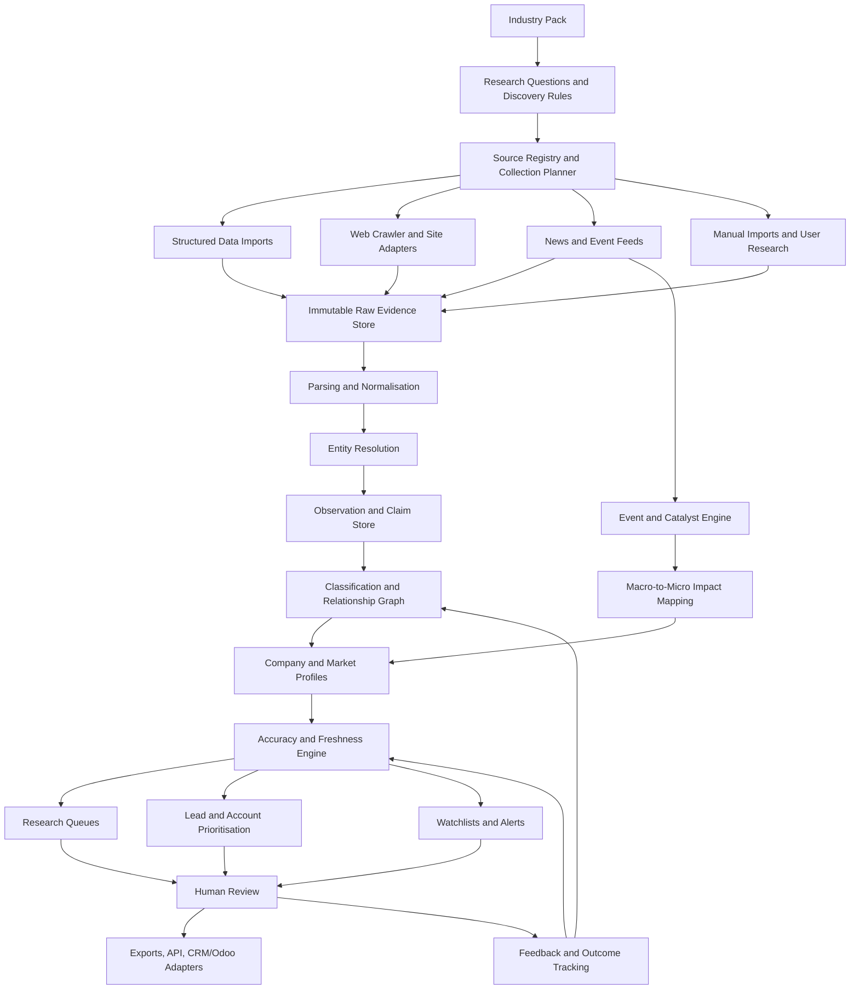

# Niche Industry Intelligence Platform
## Phase 1 Development Specification: Market Research, Company Intelligence, and Lead Generation

**Document type:** Implementation-grade product and development specification  
**Primary audience:** AI development agent  
**Initial deployment:** Local, single-organisation application  
**Initial industry configuration:** Scaffolding, access, temporary works, and adjacent construction services  
**Long-term direction:** Reusable intelligence infrastructure for opaque, fragmented, and difficult-to-research industries  
**Relationship to later phases:** This phase must create a durable evidence, entity, event, and intelligence foundation that can later support financial-market research without compromising the immediate commercial-research objective.

---

# 1. Executive Summary

The purpose of this application is to create a local, continuously improving industry-intelligence system for markets where reliable information is fragmented, inconsistent, poorly indexed, locally published, hidden in documents, or expressed through indirect signals rather than clean datasets.

The first operational use case is the scaffolding and temporary-works industry. The immediate business needs are:

- Discover and classify prospective clients.
- Identify companies that may require scaffold design, drafting, engineering support, modelling, estimation, visualisation, or adjacent services.
- Understand company size, operating maturity, geographic reach, capabilities, sectors served, likely purchasing behaviour, and commercial alignment.
- Build an evidence-backed lead database.
- Discover projects, tenders, awards, expansions, incidents, hiring changes, regulatory developments, and other events that create commercial opportunities.
- Understand broader market movements affecting demand.
- Coordinate collection and enrichment rather than relying on disconnected searches or spreadsheets.
- Preserve accuracy, provenance, uncertainty, and conflicting information.
- Allow software to perform collection, matching, calculation, and prioritisation while AI performs bounded extraction, interpretation, comparison, and synthesis.

This is not merely a website scraper or contact harvester.

It is a **local niche-industry intelligence platform** built around five durable capabilities:

1. **Industry modelling**
   - Represent an industry as a configurable ontology of company types, services, sectors, projects, roles, products, systems, geographies, relationships, and signals.

2. **Evidence-led data accumulation**
   - Collect information from many source types while preserving every fact's origin, observation date, confidence, and freshness.

3. **Entity resolution and classification**
   - Determine which references describe the same company, site, project, group, branch, person, product, or event.

4. **Macro-to-micro intelligence**
   - Connect political, economic, legal, social, technological, environmental, construction, and project developments to affected markets and individual companies.

5. **Commercial action**
   - Turn intelligence into research queues, target accounts, lead lists, watchlists, alerts, assignments, exports, integrations, and measurable business-development workflows.

The platform must be reusable. Scaffolding must be implemented as the first configurable **industry pack**, not embedded as an inseparable assumption in the core data model.

---

# 2. Product Statement

> A local-first intelligence system that discovers, verifies, organises, connects, and continuously updates information about hard-to-research industries, then converts that information into defensible market insight and commercially actionable lead intelligence.

---

# 3. Problem Definition

## 3.1 The information problem

Niche industries often have no complete source of truth.

Useful information may be distributed across:

- Company websites.
- Local business directories.
- Government registers.
- Tender and procurement portals.
- Main-contractor supplier lists.
- Project pages.
- Planning applications.
- Safety notices.
- News articles.
- Trade associations.
- Manufacturer distributor pages.
- Certification registers.
- Job advertisements.
- Social pages.
- PDF capability statements.
- Equipment listings.
- Event exhibitor lists.
- Industry awards.
- Court and insolvency notices.
- Maps.
- Archived websites.
- Contact pages.
- Staff biographies.
- Government spending records.
- Client portfolios.
- Subcontractor acknowledgements.
- Photographs and project captions.
- Publicly available structured data.

No one source is adequate. Many sources are stale, copied, incomplete, ambiguous, or promotional.

The platform must therefore derive intelligence from the **agreement and disagreement between multiple imperfect sources**.

## 3.2 The classification problem

A company may describe itself as:

- A scaffold contractor.
- An access provider.
- An industrial services contractor.
- A temporary-works specialist.
- A construction-support company.
- An equipment-hire business.
- A maintenance contractor.
- An engineering consultancy.
- A formwork and shoring provider.
- A labour provider.
- A manufacturer or distributor.
- A general contractor with an internal access division.

A single industry code is insufficient.

The application must support:

- Multiple classifications per organisation.
- Primary and secondary activities.
- Capabilities inferred from evidence.
- Distinctions between claimed, observed, and verified capabilities.
- Different classifications at group, legal-entity, branch, and operational-unit levels.
- Local industry vocabularies mapped to formal taxonomies.
- Industry-pack-specific classifications more granular than government codes.

## 3.3 The lead-generation problem

A large list of company names is not useful unless the system can answer:

- Is this genuinely an operating company?
- Is it the same company as another record?
- Where does it operate?
- What does it actually do?
- How large or sophisticated is it?
- What systems, sectors, clients, and project types does it work with?
- Does it outsource design?
- Is it likely to need the service being sold?
- Is it growing, contracting, hiring, tendering, or entering a new market?
- Who is the appropriate role or public contact point?
- What evidence supports the lead?
- How recent is the evidence?
- Has the company already been contacted?
- What new event makes contact timely?
- What is unknown and worth researching next?

## 3.4 The market-intelligence problem

Business-development decisions are affected by more than company facts.

Relevant external drivers may include:

- Infrastructure spending.
- Construction approvals.
- Maintenance cycles.
- Commodity investment.
- Energy policy.
- Industrial shutdown schedules.
- Currency movement.
- Labour shortages.
- Safety regulation.
- Procurement reform.
- Insolvencies.
- Mergers.
- Public works.
- Defence spending.
- Major project awards.
- Tariffs.
- Material costs.
- Interest rates.
- Insurance changes.
- Union activity.
- Population growth.
- Natural disasters.
- Political priorities.
- Social licence and environmental restrictions.
- Technology adoption.

The application must map these broad developments to:

```text
Event
  → geography
  → market segment
  → project type
  → buyer type
  → service demand
  → affected organisations
  → commercial action
```

---

# 4. Phase 1 Objectives

## 4.1 Primary objectives

Phase 1 must deliver a usable standalone system that can:

1. Define a target industry without rewriting the core application.
2. Discover companies and other relevant entities from multiple source types.
3. Crawl and scrape permitted public sources responsibly.
4. Import structured and semi-structured datasets.
5. Store source material and extracted observations.
6. Resolve duplicate and related entities.
7. Classify companies using a configurable industry ontology.
8. Estimate company scale, operating tier, capability, and relevance.
9. Capture public business contact information and decision-role indicators.
10. Discover projects, tenders, awards, events, and news.
11. Monitor macro and sector signals.
12. Map broad signals to target segments and companies.
13. Score accuracy, freshness, completeness, and commercial relevance separately.
14. Build ranked research and lead queues.
15. Support manual review and correction.
16. Export or programmatically expose clean intelligence.
17. Preserve an architecture suitable for later financial-market intelligence.

## 4.2 Secondary objectives

- Reduce repeated manual research.
- Make research reproducible.
- Retain organisational knowledge when staff change.
- Create a searchable history of industry observations.
- Identify gaps and contradictions automatically.
- Improve classification and prioritisation through feedback.
- Support account planning.
- Generate evidence-backed outreach context.
- Allow future integration with CRM, Odoo, email, or internal systems.
- Provide controlled AI assistance without making the system dependent on one model.

---

# 5. Non-Goals for Phase 1

Phase 1 should not become:

- A generic consumer search engine.
- A full CRM replacement.
- An automated spam or mass-email system.
- A personal-data harvesting platform.
- A social-network surveillance tool.
- A high-frequency financial-market platform.
- A comprehensive global corporate registry.
- A perfect global revenue database.
- A fully autonomous sales agent.
- A system that fabricates missing company information.
- A distributed enterprise-scale crawler before local usefulness is proven.
- A tool that bypasses authentication, access controls, anti-bot measures, or explicit prohibitions.
- A rigid scaffolding-only database.
- A collection of hard-coded source scripts with no reusable framework.
- A single opaque AI pipeline.

---

# 6. Guiding Principles

## 6.1 Evidence before assertion

The database should distinguish between:

- A source document.
- An extracted observation.
- A normalised fact.
- A classification.
- An inference.
- A hypothesis.
- A contradiction.
- A user decision.

These must not be collapsed into one field.

## 6.2 Accuracy is multidimensional

“Accuracy” is not one number.

The system should separately assess:

- Source authority.
- Source independence.
- Extraction confidence.
- Entity-match confidence.
- Classification confidence.
- Temporal freshness.
- Corroboration.
- Contradiction.
- Specificity.
- Completeness.
- Human-verification status.

## 6.3 Missing is different from false

Absence of evidence must not become evidence of absence.

Examples:

- No public employee count does not mean the company is small.
- No engineering page does not mean engineering is not provided.
- No recent news does not mean the company is inactive.
- No email on the website does not mean no contact route exists.

## 6.4 Claims and observations must be time-bound

A company may change ownership, add or remove services, open or close a branch, enter a new market, lose accreditation, stop trading, rebrand, merge, shrink, grow, or change domain.

Facts must have observed dates, valid-from or valid-to periods where possible, and freshness rules.

## 6.5 Industry knowledge must be configurable

The core platform should understand generic concepts such as:

- Organisation.
- Location.
- Person or role.
- Service.
- Product.
- Project.
- Event.
- Relationship.
- Evidence.
- Market segment.
- Geography.
- Signal.

An industry pack should define what these mean in a specific industry.

## 6.6 Human correction is a first-class input

Human edits must:

- Override weak automated conclusions.
- Preserve the original automated value.
- Record who or what made the change.
- Record the reason.
- Remain reversible.
- Inform later classification improvement.

## 6.7 Collection should be coordinated, not indiscriminate

The system should know:

- Why a source is being collected.
- Which entities or questions it may answer.
- When it was last checked.
- What changed.
- Whether the source is permitted and healthy.
- Whether deeper collection is justified.

## 6.8 AI should operate on bounded tasks

Code should handle fetching, parsing, hashing, matching rules, dates, calculations, deduplication, scheduling, scoring mechanics, data validation, and workflow state.

AI may assist with semantic classification, claim extraction, relationship hypotheses, summarisation, contradiction detection, company-description interpretation, event-impact reasoning, research-gap generation, and natural-language reporting.

## 6.9 No single model or provider may become structural

All AI functionality must be optional, replaceable, logged, and schema-constrained where practical.

## 6.10 The system should become more valuable with age

The accumulated asset is:

- Historical company states.
- Source history.
- Project history.
- Relationship history.
- Event history.
- Classification corrections.
- Lead outcomes.
- Research decisions.
- Change observations.
- Confidence performance.

---

# 7. Product Architecture

## 7.1 Conceptual architecture



## 7.2 Architectural layers

### Layer A: Industry configuration

Defines terminology, taxonomy, company archetypes, services, buyer types, market segments, project types, relevant signals, research questions, lead-fit rules, source patterns, search vocabularies, synonyms, negative terms, and known relationships.

### Layer B: Acquisition

Collects APIs, bulk datasets, RSS and Atom, HTML, PDF, JSON-LD, sitemap content, public files, user uploads, manual observations, and search-result candidates.

### Layer C: Evidence

Stores immutable raw material and collection metadata.

### Layer D: Intelligence processing

Performs parsing, language detection, translation support, entity extraction, entity resolution, classification, relationship creation, change detection, confidence calculation, event creation, and trend aggregation.

### Layer E: Commercial action

Provides research tasks, lead queues, account views, territory views, market maps, alerts, exports, integration events, and reports.

---

# 8. Industry-Pack System

## 8.1 Purpose

The platform must be reusable across industries without pretending all industries can be represented identically.

An **industry pack** supplies domain intelligence without changing the generic evidence and entity core.

## 8.2 Industry-pack contents

An industry pack may contain:

```text
industry-pack/
├── manifest
├── terminology
├── synonyms
├── exclusions
├── company_archetypes
├── service_taxonomy
├── product_taxonomy
├── market_segments
├── project_types
├── buyer_roles
├── decision_roles
├── relationship_types
├── event_types
├── catalyst_rules
├── source_templates
├── discovery_queries
├── classification_rubrics
├── lead_fit_rules
├── size_tier_rules
├── operating_tier_rules
├── evidence_expectations
├── freshness_policies
├── reporting_templates
└── seed_entities
```

The precise file format and internal implementation are left to the development agent, provided the configuration is versioned, reviewable, and testable.

## 8.3 Formal and local taxonomies

The system should support mapping to formal taxonomies such as:

- ANZSIC.
- NAICS.
- NACE.
- SIC where encountered.
- UNSPSC.
- Country-specific procurement or supplier codes.

Formal classifications are useful for interoperability and macro statistics but are usually too broad for niche commercial research.

Each industry pack therefore needs its own operational taxonomy.

## 8.4 Initial scaffolding and temporary-works pack

The initial pack should support, without limiting itself to, the following organisation archetypes:

- Scaffold contractor.
- Industrial scaffold contractor.
- Commercial scaffold contractor.
- Residential scaffold contractor.
- Infrastructure scaffold contractor.
- Labour-only scaffold provider.
- Scaffold hire or rental company.
- Scaffold sales company.
- Scaffold manufacturer.
- Scaffold importer.
- Scaffold distributor.
- Scaffold system owner.
- Access contractor.
- Rope-access provider.
- Mast-climber provider.
- Mobile-access provider.
- Formwork contractor.
- Falsework contractor.
- Shoring contractor.
- Temporary-works designer.
- Temporary-works coordinator service.
- Structural engineering consultancy.
- Scaffold design consultancy.
- Drafting or CAD outsourcing provider.
- General contractor with internal scaffold capability.
- Industrial-maintenance contractor.
- Shutdown or turnaround contractor.
- Mining-services contractor.
- Marine or offshore access provider.
- Event or staging structure provider.
- Heritage-access specialist.
- Encapsulation or containment provider.
- Roofing-access provider.
- Safety and edge-protection provider.
- Training provider.
- Inspection provider.
- Certification provider.
- Equipment-management software provider.
- Logistics or yard-management provider.
- Labour-hire business.
- Principal contractor.
- Asset owner.
- Procurement intermediary.
- Industry association.

Possible services include:

- 2D drafting.
- 3D modelling.
- Scaffold design.
- Temporary-works design.
- Engineering calculation.
- Leg-load calculation.
- Design verification.
- Independent checking.
- Quantity take-off.
- Bill of materials.
- Gear list.
- Tender drawing.
- Construction issue drawing.
- As-built documentation.
- Site integration.
- BIM coordination.
- Point-cloud integration.
- Visualisation.
- Methodology support.
- Estimation.
- Project management.
- Inspection.
- Erection.
- Dismantling.
- Hire.
- Sales.
- Transport.
- Labour supply.
- Training.
- Encapsulation.
- Weather protection.
- Edge protection.
- Special structures.
- Access engineering.

Possible scaffold or access systems include configurable values such as ringlock families, cuplock families, kwikstage families, tube and fitting, frame scaffold, aluminium systems, modular stairs, shoring systems, proprietary temporary roof systems, mast climbers, suspended access, and bespoke structural access.

These examples must seed the pack, not become hard-coded restrictions.

---

# 9. Research Modes

The application should support distinct but connected research modes.

## 9.1 Industry discovery

Purpose:

- Determine who participates in an industry.
- Discover vocabulary.
- Identify clusters, associations, products, and market structure.
- Expand the source and entity frontier.

Outputs:

- Candidate companies.
- Candidate sources.
- Candidate categories.
- Unknown terminology.
- New relationships.
- Research gaps.

## 9.2 Company discovery

Purpose:

- Find possible companies matching an industry profile or region.

Methods may include registry searches, directory searches, search queries, association member lists, tender recipients, project acknowledgements, manufacturer distributor lists, map listings, certification lists, job advertisements, event exhibitors, client supplier lists, archived pages, and structured data.

## 9.3 Company deep research

Purpose:

- Build a defensible company profile.

Questions:

- What legal and trading entities exist?
- What is the group structure?
- Where are branches and yards?
- What services are claimed?
- What services are evidenced?
- What systems or equipment appear to be used?
- What sectors and project types are served?
- What recent projects are visible?
- How mature is the company?
- What scale indicators exist?
- Which public contact routes and decision roles exist?
- What commercial needs are likely?
- What information is contradictory or stale?

## 9.4 Market research

Purpose:

- Understand market size, structure, direction, and concentration.

Possible outputs:

- Estimated company counts.
- Geographic density.
- Segment distribution.
- Company-size distribution.
- Service adoption.
- Project pipeline.
- Procurement activity.
- Hiring trend.
- Insolvency trend.
- New-entry and closure trend.
- Technology adoption.
- Manufacturer or system prevalence.
- Demand indicators.
- Competitive concentration.

All estimates must show methodology, coverage, uncertainty, and known bias.

## 9.5 Event and catalyst monitoring

Purpose:

- Detect changes that may create demand, risk, or buying shifts.

Examples:

- Infrastructure budget.
- Major project approval.
- Project award.
- New regulation.
- Safety enforcement.
- Currency movement.
- Material-cost movement.
- Natural disaster.
- Plant shutdown.
- Acquisition.
- Insolvency.
- Workforce expansion.
- New branch.
- New product.
- Tender release.
- Contract award.
- Industrial action.
- Tariff.
- Import restriction.
- Insurance change.
- Environmental approval.
- Political commitment.
- Maintenance programme.

## 9.6 Lead research

Purpose:

- Decide whether an organisation is commercially relevant now.

Outputs:

- Fit.
- Timing.
- Likely need.
- Evidence.
- Contact route.
- Suggested research action.
- Suggested outreach context.
- Unknowns.
- Suppression reasons.
- Assignment status.

---

# 10. Source Strategy

## 10.1 Source categories

The platform should support a source registry covering:

### Official and authoritative sources

- Government company registers.
- Tax or business-number registers.
- Licensing registers.
- Accreditation registers.
- Procurement portals.
- Contract-award databases.
- Planning portals.
- Regulatory notices.
- Court or insolvency notices.
- Safety regulators.
- Statistical agencies.
- Public budgets.
- Public project pipelines.
- Government publications.
- Legal-entity identifier data.

### First-party commercial sources

- Company websites.
- Investor or corporate pages.
- Press releases.
- Capability statements.
- Service pages.
- Project portfolios.
- Branch pages.
- Contact pages.
- Staff pages.
- Product catalogues.
- Technical documents.
- Terms and policies.
- Public job advertisements.

### Industry sources

- Trade associations.
- Member directories.
- Manufacturer directories.
- Distributor lists.
- Certification schemes.
- Trade journals.
- Conference exhibitor lists.
- Award programmes.
- Training registers.
- Equipment marketplaces.
- Industry newsletters.

### Project and buyer sources

- Principal-contractor websites.
- Asset-owner project pages.
- Supplier and subcontractor lists.
- Tender documents.
- Award notices.
- Project updates.
- Planning documents.
- Environmental assessments.
- Construction progress reports.
- Maintenance schedules.
- Shutdown announcements.

### Discovery and weak-signal sources

- Search engines.
- Maps.
- Public social pages.
- Video descriptions.
- Photo captions.
- Community notices.
- Local news.
- Job boards.
- Archived pages.
- Public document repositories.
- Domain and website metadata.

Weak-signal sources may generate hypotheses but should not automatically create high-confidence facts.

## 10.2 Source registry

Each source definition should include:

```yaml
SourceDefinition:
  id: UUID
  name: string
  source_category: enum
  base_url: string|null
  jurisdiction: string|null
  language: string|null
  access_method: enum
  authority_tier: integer
  expected_update_frequency: duration|null
  robots_policy_status: enum
  terms_review_status: enum
  authentication_type: enum|null
  rate_limit_policy: JSON|null
  collection_scope: JSON
  parser_profile: string|null
  active: bool
  last_success_at: datetime|null
  last_failure_at: datetime|null
  health_score: float|null
  notes: text|null
```

## 10.3 Source hierarchy

The system should not assume a universal ranking, but an initial model may distinguish:

1. Official legal or regulatory record.
2. Official company or project statement.
3. High-quality independent reporting.
4. Industry publication or association.
5. Directory or aggregator.
6. Public social or user-generated source.
7. Unattributed or weak source.

Authority does not guarantee current accuracy. A stale legal classification and a current company announcement may answer different questions.

## 10.4 Source independence

Corroboration must consider lineage.

Examples of non-independent evidence:

- Directory copies company website.
- Blog copies press release.
- News sites syndicate the same wire report.
- Multiple domains belong to the same group.
- Different pages quote the same tender notice.

The system should model copied or derivative evidence separately from independent observation.

---

# 11. Responsible Crawling and Scraping

## 11.1 Objective

Create a crawler that is reliable, polite, inspectable, and unlikely to create operational or reputational problems.

The platform should favour, in order:

1. Official API.
2. Bulk download.
3. RSS or Atom.
4. Sitemap.
5. Stable structured endpoint.
6. Public HTML.
7. Browser-assisted retrieval where necessary and permitted.
8. Manual import when automation is inappropriate.

## 11.2 Crawler identity

The crawler should use a clear user-agent identity suitable for a legitimate internal research system.

Configuration should allow product name, organisation name, contact or information URL, version, and per-source override where required.

## 11.3 Robots protocol

The crawler should implement RFC 9309-compatible robots behaviour or use a mature implementation.

Requirements:

- Fetch and cache robots rules.
- Apply the correct user-agent group.
- Record the evaluated rule.
- Stop or defer when disallowed.
- Do not interpret robots permission as legal authorisation or a licence.
- Permit explicit source-level disablement.
- Re-evaluate rules periodically.

## 11.4 Terms and access policy

The source registry should store whether:

- Terms have been reviewed.
- Automated access is expressly allowed.
- Automated access is expressly prohibited.
- Access is unclear.
- Content may be stored.
- Content may be redistributed.
- Authentication is required.
- A manual-only workflow is preferable.

The system must not circumvent login, paywalls, CAPTCHAs, rate limits, technical restrictions, or explicit prohibition.

## 11.5 Politeness

The crawler should support:

- Per-domain concurrency limits.
- Per-domain delay.
- Global concurrency limits.
- Exponential backoff.
- Retry limits.
- Conditional requests.
- ETag and Last-Modified.
- Content hashing.
- Crawl budgets.
- Quiet hours.
- Failure circuit breakers.
- Maximum page and byte limits.
- Large-file rules.
- Duplicate URL suppression.
- Canonical URL handling.

## 11.6 Crawl frontier

The crawler should not crawl an entire domain merely because it can.

Every queued URL should have:

- Discovery source.
- Research purpose.
- Priority.
- Expected entity.
- Expected content type.
- Depth.
- Parent URL.
- Industry-pack rule.
- Expiry.
- Crawl-budget class.

## 11.7 Site-adapter strategy

The development agent should determine the best balance between generic extraction, template-based parsing, domain-specific adapters, structured-data extraction, headless-browser rendering, and manual review.

The architecture should permit all approaches without making domain-specific code the core system.

## 11.8 Change detection

Store:

- First-seen timestamp.
- Last-seen timestamp.
- Last-changed timestamp.
- Content hash.
- Structured field differences.
- Removed content.
- Added content.
- Source parser version.

Changes may be more commercially important than the current page alone.

## 11.9 Retrieval evidence

For every retrieval, store enough information to reconstruct what was requested, when, from where, under which source policy, what was returned, which parser processed it, and which observations were produced.

---

# 12. Data Ingestion Beyond Crawling

## 12.1 Structured APIs

The platform should support provider adapters rather than provider assumptions.

Possible sources include business registers, company registers, legal-entity data, procurement and award APIs, statistical APIs, planning APIs, geospatial APIs, news APIs, labour-market data, trade data, exchange-rate data, and public economic data.

## 12.2 Bulk datasets

The import framework should support CSV, JSON, JSON Lines, XML, XLSX, Parquet, ZIP archives, and database dumps where appropriate.

Each import must record dataset name, publisher, version, retrieval date, coverage date, licence or use note, checksum, import mapping, rejected records, and transformation version.

## 12.3 PDF and document ingestion

The document pipeline should support:

- Native text extraction.
- Table extraction.
- Metadata extraction.
- Attachment discovery.
- Page-level provenance.
- Visual review.
- OCR only when necessary.
- Document hashing.
- Revision comparison.

Examples include capability statements, tender documents, project plans, annual reports, safety notices, product catalogues, membership lists, and planning documents.

## 12.4 Manual evidence capture

Users should be able to add URL, file, note, phone-call observation, meeting note, authorised email-derived business fact, manual classification, relationship, correction, confidence, and valid-from date.

Manual input must be distinguishable from externally sourced evidence.

---

# 13. Core Data Model

The exact physical schema may evolve. The conceptual distinctions below are mandatory.

## 13.1 Organisation

Represents a legal entity, trading entity, group, public agency, association, or operational business.

```yaml
Organisation:
  id: UUID
  canonical_name: string
  legal_name: string|null
  trading_names: list
  organisation_type: enum
  status: enum
  country_of_registration: string|null
  registration_identifiers: list
  parent_organisation_id: UUID|null
  ultimate_parent_id: UUID|null
  website_domains: list
  primary_location_id: UUID|null
  description: text|null
  first_observed_at: datetime
  last_observed_at: datetime
  profile_completeness: float
  entity_confidence: float
```

## 13.2 Operational unit

Represents a branch, yard, office, division, franchise, or business unit.

```yaml
OperationalUnit:
  id: UUID
  organisation_id: UUID
  unit_type: enum
  name: string|null
  location_id: UUID|null
  service_area: JSON
  active_status: enum
  contact_points: list
```

This distinction is essential because a legal entity may operate several branches with different capabilities.

## 13.3 Location

```yaml
Location:
  id: UUID
  address_lines: list
  locality: string|null
  region: string|null
  postal_code: string|null
  country: string|null
  latitude: decimal|null
  longitude: decimal|null
  location_type: enum
  geocode_confidence: float|null
```

Location types may include registered address, office, yard, depot, project site, factory, training centre, service-area centroid, and mailing address.

## 13.4 Person and role

The system should be conservative with personal information.

```yaml
Person:
  id: UUID
  display_name: string
  public_professional_profile: JSON|null
  current_roles: list
  evidence_ids: list
```

```yaml
RoleAssignment:
  id: UUID
  person_id: UUID|null
  organisation_id: UUID
  role_title: string
  normalised_role: string|null
  department: string|null
  seniority: enum|null
  start_date: date|null
  end_date: date|null
  public_contact_point_id: UUID|null
  confidence: float
```

The system should prioritise professional-role relevance and publicly presented business contact routes.

## 13.5 Contact point

```yaml
ContactPoint:
  id: UUID
  organisation_id: UUID
  operational_unit_id: UUID|null
  person_id: UUID|null
  contact_type: enum
  value: string
  label: string|null
  public_business_contact: bool
  role_based: bool
  first_observed_at: datetime
  last_verified_at: datetime|null
  deliverability_status: enum|null
  confidence: float
  source_evidence_ids: list
```

Contact types may include general email, role email, public professional email, phone, contact form, social business profile, postal address, and enquiry URL.

Phase 1 should not attempt intrusive personal-data enrichment.

## 13.6 Industry classification

```yaml
ClassificationAssignment:
  id: UUID
  entity_id: UUID
  taxonomy_id: UUID
  category_id: UUID
  assignment_type: enum
  confidence: float
  status: enum
  valid_from: date|null
  valid_to: date|null
  evidence_ids: list
  classifier_version: string|null
```

Assignment types:

- Registered.
- Self-described.
- Observed.
- Inferred.
- Human-confirmed.
- Rejected.

## 13.7 Service capability

```yaml
Capability:
  id: UUID
  name: string
  category: string
  industry_pack_id: UUID
```

```yaml
CapabilityAssignment:
  organisation_id: UUID
  capability_id: UUID
  capability_status: enum
  evidence_strength: float
  recency_score: float
  geographic_scope: JSON|null
  scale_indicator: JSON|null
  evidence_ids: list
```

Capability statuses:

- Claimed.
- Evidenced.
- Repeatedly evidenced.
- Verified.
- Historical.
- Uncertain.
- Contradicted.

## 13.8 Product, system, technology, or equipment

Generic entity capable of representing a scaffold system, software platform, machine, product family, construction method, certification standard, material, or technology.

## 13.9 Project

```yaml
Project:
  id: UUID
  name: string
  project_type_ids: list
  status: enum
  location_id: UUID|null
  geography_scope: JSON|null
  estimated_value: decimal|null
  currency: string|null
  start_date: date|null
  end_date: date|null
  expected_start_date: date|null
  expected_end_date: date|null
  description: text|null
  sector_ids: list
  evidence_ids: list
```

## 13.10 Project participation

```yaml
ProjectParticipation:
  project_id: UUID
  organisation_id: UUID
  role_type: enum
  status: enum
  confidence: float
  contract_value: decimal|null
  evidence_ids: list
```

Possible roles include asset owner, developer, principal contractor, engineering consultant, scaffold contractor, temporary-works designer, equipment supplier, subcontractor, bidder, award recipient, and unconfirmed participant.

## 13.11 Event

```yaml
Event:
  id: UUID
  event_type_id: UUID
  canonical_title: string
  description: text|null
  event_time: datetime|null
  first_observed_at: datetime
  last_updated_at: datetime
  status: enum
  geographic_scope: JSON
  affected_entity_ids: list
  affected_market_ids: list
  direction: enum
  estimated_magnitude: float|null
  expected_horizon: enum|null
  confidence: float
  evidence_ids: list
```

## 13.12 Relationship

```yaml
Relationship:
  id: UUID
  subject_entity_id: UUID
  object_entity_id: UUID
  relationship_type: enum
  status: enum
  confidence: float
  valid_from: date|null
  valid_to: date|null
  evidence_ids: list
```

Examples include parent of, subsidiary of, trading name of, branch of, supplier to, customer of, contractor on, competitor of, distributor of, uses system, member of association, certified by, serves geography, employs role, acquired by, partner of, and likely adjacent provider.

## 13.13 Source document

```yaml
SourceDocument:
  id: UUID
  source_definition_id: UUID
  source_url: string|null
  canonical_url: string|null
  retrieved_at: datetime
  first_seen_at: datetime
  claimed_published_at: datetime|null
  content_hash: string
  content_type: string
  raw_storage_path: string
  title: string|null
  language: string|null
  access_policy_snapshot: JSON
  collector_version: string
  parser_version: string|null
```

## 13.14 Observation

An atomic extracted statement tied to evidence.

```yaml
Observation:
  id: UUID
  subject_entity_id: UUID|null
  predicate: string
  object_value: JSON
  observed_at: datetime
  valid_from: datetime|null
  valid_to: datetime|null
  source_document_id: UUID
  source_location: JSON|null
  extraction_method: enum
  extraction_confidence: float
  normalisation_status: enum
```

## 13.15 Fact assertion

A reconciled conclusion derived from observations.

```yaml
FactAssertion:
  id: UUID
  subject_entity_id: UUID
  predicate: string
  value: JSON
  status: enum
  authority_score: float
  corroboration_score: float
  freshness_score: float
  contradiction_score: float
  final_confidence: float
  supporting_observation_ids: list
  contradicting_observation_ids: list
  rule_version: string
```

Statuses:

- Confirmed.
- Probable.
- Possible.
- Conflicted.
- Stale.
- Disproven.
- Unknown.

## 13.16 Research question

```yaml
ResearchQuestion:
  id: UUID
  entity_id: UUID|null
  question_type: string
  question_text: text
  priority: float
  generated_by: enum
  reason: text
  status: enum
  assigned_to: string|null
  due_at: datetime|null
  resolution: JSON|null
```

## 13.17 Lead or account opportunity

```yaml
AccountOpportunity:
  id: UUID
  organisation_id: UUID
  target_offering_id: UUID
  fit_score: float
  timing_score: float
  evidence_quality_score: float
  accessibility_score: float
  relationship_score: float|null
  commercial_priority: float
  opportunity_stage: enum
  reasons: list
  risks: list
  unknowns: list
  next_action: JSON|null
  owner: string|null
```

---

# 14. Entity Resolution

## 14.1 Objective

Determine whether records refer to the same legal entity, the same trading brand, a parent and subsidiary, a branch, a similarly named but unrelated company, a renamed entity, a defunct predecessor, a domain owned by a group, or a franchise or distributor.

## 14.2 Match evidence

Possible match signals:

- Registration number.
- Business number.
- LEI.
- Company number.
- Exact legal name.
- Trading name.
- Domain.
- Phone.
- Email domain.
- Address.
- Director or officer.
- Parent company.
- Logo or brand.
- Social profile.
- Description.
- Service area.
- Historical name.
- Website footer.
- Structured data.
- Shared contact page.
- Cross-linked websites.

## 14.3 Match states

- Exact deterministic match.
- High-confidence probable match.
- Possible match requiring review.
- Related but distinct.
- Confirmed distinct.
- Unresolved.

## 14.4 No destructive merge

Merging must preserve original records, source provenance, prior identifiers, merge rationale, ability to split, and relationships between legal entity, brand, and branch.

## 14.5 Entity-resolution queue

Ambiguous cases should enter a dedicated review queue sorted by commercial importance, probability of duplicate, number of conflicting facts, downstream impact, and ease of resolution.

---

# 15. Classification Framework

## 15.1 Multi-axis classification

Do not force every company into one category.

Classify across independent axes.

### Business model

- Contractor.
- Consultant.
- Manufacturer.
- Distributor.
- Rental.
- Labour provider.
- Principal contractor.
- Asset owner.
- Software provider.
- Association.
- Training provider.
- Regulator.
- Buyer.
- Intermediary.

### Service capability

Configurable by industry pack.

### Sector exposure

Examples include commercial construction, residential construction, infrastructure, rail, roads, bridges, mining, oil and gas, energy, utilities, marine, defence, industrial maintenance, manufacturing, events, heritage, and public sector.

### Project profile

- Small recurring.
- Mid-market.
- Major project.
- Shutdown.
- Maintenance.
- Bespoke engineered.
- High-risk.
- Remote.
- Urban.
- Framework contract.

### Operating geography

- Local.
- Regional.
- Statewide.
- National.
- International.
- Project-specific.

### Commercial maturity

- Informal or micro.
- Established small.
- Structured regional.
- Multi-branch.
- National.
- Enterprise.
- Group or multinational.

### Delivery sophistication

- Labour-led.
- Standard contracting.
- Internal design capability.
- External design dependency.
- Digital modelling.
- Engineering-integrated.
- BIM-integrated.
- Enterprise systems.

### Customer profile

- Homeowner.
- Builder.
- Tier-one contractor.
- Industrial asset owner.
- Government.
- Event organiser.
- Engineering consultant.
- Other scaffold contractor.

## 15.2 Classification method

Each classification should be produced from a configurable combination of deterministic evidence rules, keyword and phrase rules, structured registry data, service-page detection, project evidence, statistical model, AI classification rubric, and human confirmation.

## 15.3 Explainability

Every classification should answer:

- Why was this assigned?
- Which evidence supports it?
- How current is the evidence?
- What contradicts it?
- Was it claimed by the company or inferred?
- How confident is the system?

## 15.4 Classification learning

Human corrections should form labelled examples for later improvement.

The system may eventually support few-shot classification, local embedding similarity, supervised models, rule induction, and active learning.

No model should be trained until sufficient reliable labels exist.

---

# 16. Company Size and Operating Tier

## 16.1 No false precision

Privately held niche companies rarely publish reliable revenue or headcount.

The system should estimate **size bands and operating tiers**, not fabricate precise figures.

## 16.2 Potential size indicators

- Registered employee count where legitimately available.
- Public professional-profile headcount.
- Number of branches.
- Number of yards.
- Fleet or equipment claims.
- Project count.
- Project scale.
- Contract values.
- Government awards.
- Job-ad volume.
- Website depth.
- Number of named staff.
- Geographic reach.
- Accreditations.
- Insurance or licence class.
- Group structure.
- Manufacturer status.
- Public accounts.
- Asset references.
- Turnover band.
- Search and news footprint.
- Tender eligibility.
- Site photographs.
- Capability-statement language.

## 16.3 Separate concepts

Maintain distinct estimates for:

- Legal-entity size.
- Operating-group size.
- Local-branch size.
- Industry-specific capability tier.
- Commercial sophistication.
- Procurement sophistication.
- Likely outsourcing need.

## 16.4 Example operating tiers

An industry pack may define a rubric similar to:

- **Tier A — Strategic enterprise**
  - Large multi-region operation.
  - Major-project capability.
  - Formal procurement.
  - Internal management structure.
  - Significant recurring opportunity.

- **Tier B — Established regional**
  - Strong regional presence.
  - Multiple crews or locations.
  - Complex-project capability.
  - Clear professional contacts.

- **Tier C — Structured local**
  - Stable company.
  - Limited geography.
  - Recurrent projects.
  - Some specialist needs.

- **Tier D — Small operator**
  - Limited evidence.
  - Small projects.
  - Owner-led.
  - Potential fit for selective services.

- **Unresolved**
  - Insufficient evidence.

The specific naming and thresholds should remain configurable.

---

# 17. Accuracy and Confidence System

## 17.1 Field-level confidence

Confidence must exist at the field or assertion level, not merely the company level.

## 17.2 Confidence components

A possible model:

```text
final_confidence =
    source_authority
  × extraction_confidence
  × entity_match_confidence
  × freshness
  × corroboration_adjustment
  × specificity_adjustment
  × contradiction_adjustment
```

The development agent may choose another calibrated formula. All components must remain inspectable.

## 17.3 Source authority

Authority should depend on the question.

Examples:

- Legal status: registry is strong.
- Current service offering: current company page may be stronger.
- Project participation: award notice or project page is strong.
- Actual capability: repeated project evidence may outweigh marketing copy.
- Current staff role: recent first-party profile may be stronger than an old directory.

## 17.4 Freshness

Freshness policies should vary by field.

Examples:

- Registration status: refresh frequently.
- Phone number: moderate decay.
- Service capability: slower decay but monitor changes.
- Employee role: faster decay.
- Project participation: historical and should not decay as an event.
- Current operating geography: moderate decay.
- Accreditation: expiry-aware.
- Company description: moderate decay.
- Market condition: rapid decay.

## 17.5 Corroboration

Corroboration must consider independent origin, temporal agreement, specificity, directness, and whether a source merely copied another.

## 17.6 Contradiction

Contradictory observations should not be overwritten.

Examples:

- Website says national; all observed work is local.
- Registry says active; website is dead and premises appear closed.
- Directory says engineering; company site does not.
- Old capability statement lists a branch that disappeared.
- Two sources show different employee counts.

The UI should display conflicts and generate research questions.

## 17.7 Confidence vocabulary

Use both numeric and human-readable values:

- Verified.
- High confidence.
- Moderate confidence.
- Low confidence.
- Speculative.
- Conflicted.
- Stale.
- Unknown.

## 17.8 Accuracy feedback

When a user confirms or disproves information, record prior confidence, outcome, source types involved, rule or model version, and time since observation.

This allows future calibration.

---

# 18. Company Profile

A company profile should be an intelligence workspace, not a static card.

## 18.1 Identity section

- Canonical name.
- Legal name.
- Trading names.
- Registration identifiers.
- Status.
- Parent and subsidiaries.
- Website and domains.
- Locations.
- Entity confidence.
- Duplicate warnings.

## 18.2 Commercial summary

- Company archetypes.
- Operating tier.
- Estimated scale bands.
- Service capabilities.
- Market sectors.
- Project types.
- Geographies.
- Systems, products, or technologies.
- Likely buyer profile.
- Likely outsourcing needs.
- Strategic alignment.

## 18.3 Evidence summary

For every important field:

- Current value.
- Confidence.
- Freshness.
- Source count.
- Best evidence.
- Contradiction count.
- Last verified.

## 18.4 Activity

- Recent projects.
- Tenders.
- Awards.
- Hiring.
- News.
- Website changes.
- Accreditations.
- Branch changes.
- Leadership changes.
- Insolvency or risk signals.
- Events.
- Research actions.

## 18.5 Contacts

- General public business contacts.
- Role-based contacts.
- Public decision-role candidates.
- Contact forms.
- Branch contacts.
- Last verified.
- Source.
- Internal outreach status.

## 18.6 Relationships

- Parent.
- Subsidiaries.
- Clients.
- Contractors.
- Suppliers.
- Partners.
- Associations.
- Competitors.
- Systems used.
- Projects.
- Common directors where appropriate and public.
- Geographic clusters.

## 18.7 Research gaps

Automatically generated questions such as:

- Does the company maintain design internally?
- Which scaffold systems are used?
- Is the listed branch still active?
- Is the company part of a larger group?
- Which sectors dominate its work?
- Who owns estimating or design procurement?
- Is the company currently hiring?
- Does it bid on major projects?
- Is there evidence of recent growth?

## 18.8 Commercial action

- Lead-fit score.
- Timing score.
- Evidence quality.
- Priority.
- Suggested next research step.
- Suggested reason for outreach.
- Suppression reason.
- Owner.
- CRM state.
- Notes.
- Outcome.

---

# 19. Lead Intelligence

## 19.1 Lead creation

A lead should be created only when an organisation is relevant to a configured offering.

Example offering:

```text
Scaffold design and drafting outsourcing
```

The same company may have different fit for drafting, engineering, 3D modelling, software, estimating, temporary works, labour, or equipment.

## 19.2 Lead dimensions

Maintain separate scores:

- Industry fit.
- Service fit.
- Company scale.
- Need likelihood.
- Timing.
- Evidence quality.
- Contactability.
- Geographic fit.
- Strategic value.
- Existing relationship.
- Competition or conflict.
- Research completeness.

## 19.3 Need indicators

For scaffold design and drafting, possible signals include:

- Complex-project portfolio.
- Major-project awards.
- Hiring for designers or estimators.
- No visible internal design team.
- Rapid geographic expansion.
- Multiple scaffold systems.
- Tender activity.
- Large project images but weak technical presentation.
- Engineering outsourced to third parties.
- Stated BIM or 3D capability.
- High volume of project work.
- Design-related job advertisements.
- New branch.
- Partnership with engineering firms.
- Quality or documentation emphasis.
- Principal-contractor prequalification.
- Temporary-works requirements.
- Cross-border project activity.

These should be hypotheses configurable in the industry pack.

## 19.4 Negative indicators

- Company does not provide relevant service.
- Company is inactive.
- Company is a direct competitor in the same outsourced service.
- Company is too small for the offering.
- Company appears to have a mature internal team with no relevant gap.
- Geography is incompatible.
- Contact has opted out.
- Existing relationship makes outreach inappropriate.
- Evidence is too weak.
- Company has unresolved identity.
- Company is in distress unless distress itself creates a different relevant offering.

## 19.5 Timing signals

- New award.
- Tender win.
- Major project commencement.
- Expansion.
- Hiring.
- Acquisition.
- New framework agreement.
- Regulatory deadline.
- Seasonal maintenance cycle.
- Natural-disaster recovery.
- Infrastructure funding.
- Currency shift favouring outsourcing.
- Project backlog increase.
- New system adoption.
- Competitor closure.
- Capacity shortage.

## 19.6 Lead explanations

Every score must produce reasons such as:

```text
High industry fit because:
- Repeated evidence of commercial and infrastructure scaffolding.
- Uses multiple modular systems.
- Participated in three major projects in the last 18 months.

Elevated timing because:
- Recently awarded access package on a large project.
- Advertising for an estimator and project manager.
- Added a second operating location.

Uncertainty:
- No reliable evidence of internal design staffing.
- Public employee estimate is inconsistent.
```

## 19.7 Outreach context

The system may prepare a factual briefing containing why the company is relevant, recent event, known capability, potential service alignment, appropriate role, evidence citations, topics to avoid, and unknowns.

It should not automatically send outreach during Phase 1.

---

# 20. Contact and Role Intelligence

## 20.1 Goal

Identify legitimate business contact routes and likely organisational roles without turning the platform into a personal-data harvesting system.

## 20.2 Contact priority

Prefer:

1. Public role-based email.
2. Public general business email.
3. Official contact form.
4. Public branch phone.
5. Public professional contact presented for business use.
6. General phone.
7. Manual research task.

## 20.3 Role taxonomy

The industry pack may identify roles such as owner, managing director, general manager, operations manager, commercial manager, business-development manager, estimating manager, design manager, engineering manager, temporary-works coordinator, project manager, procurement manager, contracts manager, scaffold manager, access manager, BIM manager, drafting manager, branch manager, and yard manager.

## 20.4 Decision-role inference

AI may infer likely relevance of a role, but the result must be labelled as an inference.

The system should not infer private email formats and present them as verified contact information.

## 20.5 Contact verification

Store first observed, last observed, source, public-business status, role association, deliverability result if legitimately tested, user-confirmed outcome, and opt-out or suppression.

---

# 21. Macro and Broad Market Intelligence

## 21.1 Objective

Develop a view of market conditions that affect industry demand and buying behaviour.

## 21.2 Signal domains

Use a PESTLE-like but extensible structure.

### Political

- Government policy.
- Elections.
- Infrastructure commitments.
- Public procurement changes.
- Trade policy.
- Defence policy.
- Local-content requirements.

### Economic

- Construction activity.
- Interest rates.
- Inflation.
- Labour cost.
- Currency movement.
- Commodity investment.
- Business confidence.
- Insolvencies.
- Credit conditions.
- Public spending.

### Social

- Population growth.
- Housing need.
- Labour availability.
- Safety expectations.
- Urbanisation.
- Community opposition.
- Workforce demographics.

### Technological

- BIM adoption.
- Digital design.
- Automation.
- New access systems.
- Robotics.
- Remote inspection.
- Software adoption.
- Modular construction.

### Legal and regulatory

- Safety regulation.
- Engineering requirements.
- Licensing.
- Building-code changes.
- Industrial-relations changes.
- Procurement rules.
- Insurance requirements.
- Environmental approvals.

### Environmental

- Natural disaster.
- Extreme weather.
- Energy transition.
- Emissions policy.
- Remediation.
- Decommissioning.
- Climate adaptation.

Additional domain-specific categories should be permitted.

## 21.3 Market signal entity

```yaml
MarketSignal:
  id: UUID
  signal_type: enum
  title: string
  description: text
  geography: JSON
  sectors: list
  first_observed_at: datetime
  effective_date: datetime|null
  expected_duration: enum|null
  direction: enum
  magnitude: float|null
  confidence: float
  source_evidence_ids: list
```

## 21.4 Macro-to-micro mapping

The system should map:

```text
Signal
  → affected geography
  → affected sector
  → affected project type
  → likely buyer organisations
  → likely supplier organisations
  → likely service demand
  → lead and watchlist changes
```

Example:

```text
Government rail investment
  → rail infrastructure market
  → stations, bridges, maintenance, possessions
  → principal contractors and rail access providers
  → scaffold and temporary-works demand
  → design and drafting demand
  → candidate companies and projects
```

## 21.5 Market estimates

The system may estimate addressable company population, active company population, segment share, regional concentration, activity trend, hiring trend, tender volume, contract-award value, project pipeline, supplier concentration, and service adoption.

Every estimate must expose data coverage, calculation method, source period, missing regions, known selection bias, confidence interval or confidence band where possible, and whether it is a count, estimate, index, or proxy.

## 21.6 Trend indices

Where direct market size is impossible, create transparent indices such as:

- Tender activity index.
- Project announcement index.
- Hiring pressure index.
- Website expansion index.
- Regulatory pressure index.
- Company formation index.
- Insolvency risk index.
- Design-demand proxy.
- Major-project exposure index.

Indices must never be presented as precise economic values.

---

# 22. News, Events, and Catalyst Engine

## 22.1 Story clustering

Multiple articles about one development should become one story.

The system should track first seen, last seen, article count, independent-origin count, primary-source count, geography, organisations, market segments, event type, novelty, momentum, confidence, and contradictions.

## 22.2 Event taxonomy

The core should allow generic event types. Industry packs should extend them.

Possible event types:

- Company formation.
- New branch.
- Closure.
- Acquisition.
- Merger.
- Insolvency.
- Leadership change.
- Hiring expansion.
- Layoff.
- Contract award.
- Tender release.
- Bid shortlist.
- Project approval.
- Project delay.
- Project cancellation.
- Project completion.
- Regulatory change.
- Safety notice.
- Incident.
- Legal action.
- New product.
- New certification.
- Partnership.
- Framework appointment.
- Funding announcement.
- Budget change.
- Tariff.
- Currency shock.
- Commodity shock.
- Natural disaster.
- Industrial action.
- Technology adoption.

## 22.3 Catalyst interpretation

The system should distinguish direct observed effect, likely effect, possible effect, unclear effect, and contradictory effects.

Example:

```text
Currency movement may:
- Increase the attractiveness of offshore drafting.
- Raise imported equipment costs.
- Change project margins.
- Affect competitors differently.
```

## 22.4 Event impact graph

```yaml
EventImpact:
  event_id: UUID
  target_entity_id: UUID
  impact_type: enum
  direction: enum
  expected_horizon: enum
  magnitude_estimate: float|null
  confidence: float
  reasoning: text
  supporting_evidence_ids: list
  contradicting_evidence_ids: list
```

## 22.5 Catalyst-driven commercial actions

An event may raise lead priority, create new leads, lower priority, create a watch condition, generate a research question, trigger company refresh, trigger project refresh, generate an account briefing, notify a user, or produce an export or integration event.

---

# 23. Relationship and Knowledge Graph

## 23.1 Why a graph matters

Niche-industry intelligence is often relational.

A company becomes relevant because it worked for a target client, uses a certain system, operates on a relevant project, shares a director with another company, distributes a manufacturer, belongs to an association, serves an expanding sector, hired a relevant role, acquired a competitor, or opened a branch near a project.

These relationships cannot be represented adequately in flat lead tables.

## 23.2 Graph requirements

- Typed nodes.
- Typed edges.
- Direction.
- Confidence.
- Validity period.
- Evidence.
- Contradiction.
- Manual confirmation.
- Industry-pack extensions.
- Queryable paths.
- Visualisation where useful.

## 23.3 Example graph queries

- Find scaffold contractors working for tier-one builders in Queensland.
- Find companies using ringlock systems with no visible design team.
- Find temporary-works consultants connected to infrastructure projects.
- Find manufacturers whose distributors operate in New Zealand.
- Find companies associated with three or more recently awarded projects.
- Find target companies sharing projects with existing clients.
- Find branches within a defined radius of major project sites.
- Find companies where a new manager joined from a known client.
- Find sectors with rising tender activity but low known supplier density.

The implementation may use relational graph patterns initially. A dedicated graph database is optional and should be introduced only if justified.

---

# 24. Research Orchestration

## 24.1 Research plans

The system should support reusable research plans such as:

- Discover all probable scaffold contractors in a region.
- Deep-research the top 100.
- Identify companies with industrial-sector exposure.
- Find likely users of a specific scaffold system.
- Monitor infrastructure awards.
- Monitor competitor expansion.
- Refresh stale contacts.
- Find companies with insufficient design evidence.
- Map all participants in a major project.

## 24.2 Research-plan stages

```text
Define question
  → generate candidate sources and queries
  → collect
  → resolve entities
  → classify
  → identify gaps
  → perform targeted enrichment
  → review
  → publish intelligence
  → monitor
```

## 24.3 Adaptive research

The software should be capable of choosing the next research action based on uncertainty.

Example:

```text
Company appears relevant
but size is unknown
  → inspect projects, locations, job ads, public accounts, and awards

Company name is ambiguous
  → inspect registration number, domain, phone, address, and group relationships

Service capability is uncertain
  → inspect project pages, capability PDF, job roles, and client references
```

AI may propose research actions, but code should schedule, track, and validate them.

## 24.4 Research budgets

Every plan should support limits for time, number of pages, number of domains, AI calls, storage, research depth, and entity count.

This prevents uncontrolled crawling and analysis.

---

# 25. Programmatic Action Layer

## 25.1 Objective

Accumulated intelligence must be usable by other systems and workflows.

## 25.2 Internal actions

The rule engine should support actions such as:

- Create candidate.
- Create lead.
- Update score.
- Add to watchlist.
- Add research task.
- Trigger refresh.
- Mark stale.
- Request human review.
- Create report.
- Export records.
- Emit event.
- Create integration payload.

## 25.3 Rule example

```yaml
Rule:
  name: major_project_award_design_opportunity
  when:
    event_type: contract_award
    project_scale: major
    target_company_type:
      - scaffold_contractor
      - temporary_works_provider
    evidence_confidence_min: 0.75
  then:
    - refresh_company_profile
    - recompute_service_fit
    - create_research_question:
        type: internal_design_capacity
    - raise_timing_score
    - add_to_queue:
        queue: commercial_review
```

The exact rule language is open to implementation.

## 25.4 External interfaces

Phase 1 should provide:

- CSV export.
- JSON export.
- Local REST API.
- Stable entity identifiers.
- Change feed or webhook abstraction.
- Import and export mapping.
- Optional direct database read model only if safe.

Future adapters may include Odoo, CRM, email, spreadsheet, BI tool, and internal notification systems.

The core application must not depend on any one external system.

---

# 26. AI Architecture and Boundaries

## 26.1 AI roles

AI is useful when the task requires semantic interpretation rather than exact computation.

Permitted roles:

- Extract a service list from a company page.
- Classify a company using a supplied rubric.
- Convert a capability statement into structured claims.
- Identify named projects and participants.
- Propose company relationships.
- Detect contradictions between documents.
- Summarise a market event.
- Explain why a lead was surfaced.
- Generate research questions.
- Compare current and historical company descriptions.
- Draft a factual account briefing.
- Translate foreign-language source content while retaining the original.

## 26.2 Code-owned tasks

Code must own URL collection, access-policy enforcement, dates, hashes, exact identifiers, arithmetic, geospatial distance, statistical aggregation, rule evaluation, deduplication mechanics, confidence formula, workflow transitions, export, and audit log.

## 26.3 AI output requirements

Where practical:

- Structured schema.
- Evidence references.
- Confidence.
- Explicit unknowns.
- Explicit inferences.
- No unsupported claims.
- Prompt version.
- Model version.
- Provider.
- Input hash.
- Output validation.

## 26.4 Independent AI review

High-impact classifications may use multiple bounded passes:

1. Extractor.
2. Classifier.
3. Sceptic.
4. Reconciler.

Do not implement elaborate multi-agent theatre unless it improves measurable quality.

## 26.5 Local-first AI

The application should support local model, remote model, hybrid, and AI-disabled mode.

Sensitive internal notes should not leave the local machine unless explicitly configured.

## 26.6 AI cost control

- Cache by content hash and prompt version.
- Use deterministic filters before AI.
- Use smaller models for extraction.
- Use stronger models only for ambiguous or valuable cases.
- Batch where supported.
- Set per-plan budgets.
- Track cost even when a provider is currently free.

---

# 27. Search and Discovery Engine

## 27.1 Search types

- Full-text.
- Faceted.
- Semantic.
- Graph.
- Geographic.
- Temporal.
- Evidence-aware.
- Confidence-aware.

## 27.2 Example user queries

- Scaffold contractors in Victoria with industrial project experience.
- Companies likely to outsource design.
- Access contractors added in the last six months.
- Regional contractors with evidence of growth.
- Companies working on rail projects but missing from our CRM.
- Temporary-works firms connected to scaffold contractors.
- All evidence supporting Company X's operating tier.
- Companies with conflicted contact details.
- Major projects likely to require access design in the next year.
- Events that raised demand in New Zealand.
- Companies whose websites recently added engineering services.

## 27.3 Saved searches

Users should be able to save searches as live list, watchlist, research-plan input, dashboard widget, export definition, or alert condition.

---

# 28. User Interface

The application may run as a local web application, installable PWA, or another locally executable interface. The development agent has freedom to choose a practical delivery mechanism.

## 28.1 Main navigation

Suggested workspaces:

- Overview.
- Companies.
- Leads.
- Markets.
- Projects.
- Events.
- Research queues.
- Sources.
- Industry configuration.
- Data quality.
- Administration.

## 28.2 Overview dashboard

Show:

- New companies discovered.
- Companies changed.
- New high-priority leads.
- Major market signals.
- New projects and awards.
- Unresolved duplicates.
- Stale priority records.
- Source failures.
- Research backlog.
- Recent user actions.
- Intelligence coverage.

## 28.3 Company explorer

Filters:

- Geography.
- Classification.
- Service.
- Sector.
- Operating tier.
- Size band.
- Confidence.
- Freshness.
- Lead status.
- Contactability.
- System or technology.
- Project participation.
- Event exposure.
- Research completeness.

## 28.4 Lead queue

Recommended fields:

- Organisation.
- Geography.
- Primary archetype.
- Operating tier.
- Fit.
- Timing.
- Evidence quality.
- Contactability.
- Trigger event.
- Unknowns.
- Owner.
- Next action.
- Last researched.

## 28.5 Market workspace

- Market definition.
- Geographic scope.
- Company population.
- Segment breakdown.
- Activity indices.
- Project pipeline.
- Event timeline.
- Tender and award activity.
- Key organisations.
- Growth and decline signals.
- Methodology.
- Coverage.
- Confidence.
- Data gaps.

## 28.6 Project workspace

- Project.
- Status.
- Location.
- Value estimate.
- Timeline.
- Buyer.
- Principal contractor.
- Participants.
- Relevant work packages.
- Evidence.
- Related leads.
- Events.
- Research gaps.

## 28.7 Evidence viewer

Users must be able to inspect original source, captured content, page or text location, extracted observations, derived facts, confidence, rule or model, contradictions, and historical versions.

## 28.8 Research queue

Queues may include:

- Entity resolution.
- Company classification.
- Contact verification.
- Lead review.
- Contradiction review.
- Stale priority account.
- Source parser failure.
- Unknown project participant.
- High-value research gap.
- AI validation failure.

## 28.9 Industry-pack editor

Allow controlled editing of categories, synonyms, exclusions, rubrics, event types, lead rules, source patterns, freshness, score weights, and discovery queries.

Changes must be versioned.

---

# 29. Local Technical Architecture

The development agent may choose a better implementation where justified. The following is a suitable baseline, not a mandatory prescription.

## 29.1 Suggested shape

```text
niche-industry-intelligence/
├── applications/
│   ├── api/
│   ├── worker/
│   ├── frontend/
│   └── cli/
├── packages/
│   ├── core_domain/
│   ├── industry_packs/
│   ├── source_registry/
│   ├── collectors/
│   ├── crawler/
│   ├── parsers/
│   ├── documents/
│   ├── entity_resolution/
│   ├── classifications/
│   ├── knowledge_graph/
│   ├── confidence/
│   ├── market_intelligence/
│   ├── lead_intelligence/
│   ├── research_orchestration/
│   ├── rules/
│   ├── ai/
│   ├── integrations/
│   └── common/
├── data/
│   ├── raw/
│   ├── processed/
│   ├── indexes/
│   ├── exports/
│   └── backups/
├── migrations/
├── tests/
├── scripts/
├── configuration/
└── documentation/
```

## 29.2 Suitable technologies

Potential baseline:

- Python for collection, processing, and analytics.
- FastAPI or equivalent local API.
- PostgreSQL for operational relational data.
- PostgreSQL full-text and optional vector extension.
- Parquet and DuckDB for larger analytical datasets.
- Polars or equivalent for transformations.
- Pydantic or equivalent for schemas.
- SQLAlchemy and migrations.
- Playwright or equivalent only for sources requiring permitted rendering.
- A robust HTML extraction stack.
- A mature robots parser.
- React or another maintainable frontend.
- Docker Compose or a simple native installer.
- Local AI-provider abstraction.

The development agent should avoid unnecessary infrastructure.

## 29.3 Deployment modes

At minimum:

- Local development mode.
- Local production mode.
- Backup and restore.
- Export mode.

Potential future mode:

- Small private server with authenticated access.

Phase 1 should remain optimised for local operation.

## 29.4 Storage strategy

Separate operational data, raw evidence, search index, analytical snapshots, AI cache, export data, logs, and backups.

## 29.5 Installation

The target experience should be:

- Simple documented install.
- One-command or one-executable startup where practical.
- Browser opens locally.
- Clear health status.
- Clear data path.
- Clear backup path.
- Clear configuration path.

A polished native installer is desirable after the core product works.

---

# 30. Workflow and Job System

## 30.1 Job classes

- Source refresh.
- Dataset import.
- Crawl.
- Parse.
- Document extraction.
- Entity resolution.
- Classification.
- Relationship inference.
- Confidence recomputation.
- Market aggregation.
- Event clustering.
- Lead scoring.
- Contact refresh.
- Staleness scan.
- Export.
- AI task.
- Backup.
- Data-quality check.

## 30.2 Job properties

Every job should be observable, retryable, cancelable where practical, idempotent where practical, versioned, bounded, auditable, resumable where costly, and isolated from unrelated failures.

## 30.3 Priority

Suggested priority classes:

- Interactive user request.
- High-value lead refresh.
- Event-triggered update.
- Scheduled priority source.
- Background enrichment.
- Low-priority discovery.
- Maintenance.

## 30.4 Source failure

A failing source should enter degraded state, stop repeated aggressive retries, preserve prior data, surface an alert, permit manual disablement, and not block other sources.

---

# 31. Data Quality and Governance

## 31.1 Quality dimensions

Track:

- Coverage.
- Completeness.
- Validity.
- Consistency.
- Freshness.
- Uniqueness.
- Provenance.
- Confidence.
- Review status.

## 31.2 Quality dashboard

Examples:

- Priority companies missing registration identifier.
- Companies missing location.
- Conflicted website domains.
- Duplicate contact points.
- Stale high-priority leads.
- Unresolved parent companies.
- Unsupported high-confidence classifications.
- Broken source adapters.
- Documents not parsed.
- AI claims without evidence.
- Projects without participants.
- Market estimates with poor coverage.

## 31.3 Audit trail

Log user edits, automated changes, merge and split, rule execution, model classification, AI input and output, source retrieval, exports, integration events, score changes, and suppression changes.

## 31.4 Versioning

Version industry packs, taxonomies, classification rules, confidence rules, lead scoring, parsers, collectors, prompts, AI models, market-index formulas, and export schemas.

---

# 32. Security and Privacy

## 32.1 Local defaults

- Bind to localhost.
- Require explicit configuration for network access.
- Store secrets outside version control.
- Restrict file permissions.
- Protect backups.
- Avoid telemetry by default.
- Clearly label remote AI use.
- Allow local-only mode.

## 32.2 Personal information

Collect only information that is relevant, public, and appropriate for legitimate B2B research.

The platform should:

- Focus on organisations and professional roles.
- Store source provenance.
- Support deletion or suppression.
- Avoid sensitive personal attributes.
- Avoid private contact inference.
- Avoid personal social-content profiling.
- Distinguish public professional details from general public information.
- Permit field-level retention policies.

## 32.3 Outreach suppression

Store:

- Do not contact.
- Opt-out.
- Existing client restrictions.
- Existing conversation owner.
- Conflict.
- Invalid contact.
- Legal or policy suppression.

Exports must respect suppression.

---

# 33. Analytics and Reporting

## 33.1 Company-population analysis

- Count by region.
- Count by archetype.
- Count by service.
- Count by tier.
- Count by sector.
- Count by system.
- Count by confidence.
- Discovery-source contribution.
- New and inactive companies.
- Coverage gaps.

## 33.2 Lead analytics

- Leads discovered.
- Leads qualified.
- Leads rejected.
- Research time.
- Contactability.
- Reasons for qualification.
- Reasons for rejection.
- Source effectiveness.
- Lead outcomes.
- Score calibration.
- Segment conversion.

## 33.3 Market reporting

A report should state:

- Question.
- Geography.
- Time period.
- Definitions.
- Sources.
- Coverage.
- Methodology.
- Estimates.
- Confidence.
- Contradictions.
- Data gaps.
- Implications.
- Candidate actions.

## 33.4 Change reporting

- Companies changed this week.
- New services.
- New branches.
- New projects.
- Staff-role changes.
- New tenders.
- New awards.
- New risk signals.
- Lead-priority changes.
- Source changes.

## 33.5 Reproducibility

Reports should retain query definition, dataset snapshot, industry-pack version, rule versions, generation time, and evidence references.

---

# 34. Scaffolding-Specific Initial Research Questions

These questions should guide the first industry pack but not constrain the platform.

## 34.1 Company discovery

- Which scaffold and access companies operate in Australia and New Zealand?
- Which service areas and branches do they maintain?
- Which companies focus on commercial, infrastructure, industrial, mining, marine, rail, residential, or events?
- Which use modular systems, tube and fitting, frame systems, aluminium, or special access?
- Which offer design internally?
- Which appear to outsource design?
- Which have engineering capability?
- Which have substantial project portfolios?
- Which are growing?

## 34.2 Commercial-fit research

- Which contractors regularly perform work complex enough to require external design?
- Which have no visible design staff?
- Which have tender or major-project activity?
- Which operate across several systems or jurisdictions?
- Which appear to need overflow capacity?
- Which may value white-label drafting?
- Which have poor or inconsistent technical documentation?
- Which work for existing target clients or adjacent networks?

## 34.3 Market research

- Where is scaffold demand increasing?
- Which project sectors are expanding?
- Which regions have low supplier density?
- Which systems are gaining usage?
- Which contractors are consolidating?
- Which companies are entering or leaving markets?
- What regulations increase documentation requirements?
- What currency or labour movements improve offshore-service economics?
- What projects create design demand?
- Which contractors are positioned for those projects?

## 34.4 Competitive research

- Who provides outsourced scaffold design?
- Which engineering firms serve scaffold contractors?
- What commercial models appear common?
- Which companies provide software or automation?
- What capabilities are differentiators?
- Where is the market underserved?

---

# 35. Development Milestones

## Milestone 0: Foundation

Deliver:

- Repository.
- Local configuration.
- Database.
- Migrations.
- Raw storage.
- Job framework.
- Logging.
- Health page.
- Backup.
- Test framework.

Acceptance:

- Application starts locally.
- Database can be recreated.
- Data paths are explicit.
- Jobs can be observed.
- Backup and restore are proven.

## Milestone 1: Industry-pack framework

Deliver:

- Industry-pack manifest.
- Versioning.
- Taxonomy import.
- Synonyms.
- Classification rubrics.
- Lead rules.
- Freshness policies.
- Initial scaffolding pack.

Acceptance:

- A second test industry can be created without changing core tables.
- Pack changes are versioned.
- Pack validation catches invalid configuration.
- Scaffolding categories are editable.

## Milestone 2: Source registry and evidence store

Deliver:

- Source registry.
- Raw-document model.
- API, feed, file, and HTML collector interfaces.
- Access-policy metadata.
- Hashing.
- Source health.

Acceptance:

- Original evidence is preserved.
- Duplicate retrieval is recognised.
- Source failure is isolated.
- Source policy is visible.

## Milestone 3: Responsible crawler

Deliver:

- Robots evaluation.
- Crawl frontier.
- Domain budgets.
- Rate limiting.
- Conditional retrieval.
- Sitemap support.
- Generic HTML extraction.
- Parser profiles.
- Change detection.

Acceptance:

- Disallowed paths are not crawled.
- Per-domain limits work.
- Crawl purpose and lineage are retained.
- Changed pages create new observations without deleting history.

## Milestone 4: Entity core and resolution

Deliver:

- Organisation.
- Operational unit.
- Location.
- Domain.
- Identifier.
- Contact point.
- Merge and split.
- Match scoring.
- Resolution queue.

Acceptance:

- Duplicate companies can be found and safely merged.
- Branch and parent relationships are not flattened.
- Ambiguous matches remain reviewable.
- Every merge is reversible.

## Milestone 5: Company discovery and profile

Deliver:

- Company discovery workflow.
- Company profile.
- Evidence viewer.
- Classification.
- Service capabilities.
- Geography.
- Size and tier estimates.
- Research gaps.

Acceptance:

- The system can discover and profile an initial regional company population.
- Every profile field exposes evidence and confidence.
- Missing data remains missing.
- Conflicts are visible.

## Milestone 6: Projects, relationships, and graph

Deliver:

- Projects.
- Participation.
- Relationships.
- Graph query layer.
- Project workspace.
- Relationship evidence.

Acceptance:

- Companies can be connected through projects and business relationships.
- Relationship confidence is inspectable.
- Historical relationships retain dates.
- Useful multi-hop queries are possible.

## Milestone 7: News, events, and macro signals

Deliver:

- News collection.
- Story clustering.
- Event taxonomy.
- Market signals.
- Event-impact mapping.
- Company and segment watchlists.

Acceptance:

- Duplicate reporting clusters.
- One event can affect several market segments and organisations.
- Direct fact and inferred impact remain separate.
- Events can change research and lead priority.

## Milestone 8: Lead intelligence

Deliver:

- Offering definitions.
- Lead scoring.
- Timing signals.
- Negative indicators.
- Contactability.
- Lead queue.
- Account brief.
- Suppression.

Acceptance:

- Leads are generated for a specific offering.
- Scores have explanations.
- Weak evidence lowers confidence.
- Suppression is respected.
- No outreach is sent automatically.

## Milestone 9: Macro market workspace

Deliver:

- Market definitions.
- Segment and geography analysis.
- Trend indices.
- Project pipeline.
- Tender and award aggregation.
- Methodology and coverage display.

Acceptance:

- Users can produce a defensible market report.
- Every estimate states coverage and uncertainty.
- Macro signals map to micro entities.
- Historical snapshots are preserved.

## Milestone 10: Programmatic action and integrations

Deliver:

- Rule engine.
- REST API.
- CSV and JSON exports.
- Change feed.
- Integration adapter framework.
- Initial optional Odoo-compatible export or adapter boundary.

Acceptance:

- Intelligence can create tasks and queues.
- External systems can consume stable identifiers.
- Exports respect suppression.
- Integration failure does not corrupt core data.

## Milestone 11: AI-assisted intelligence

Deliver:

- AI-provider abstraction.
- Structured extraction.
- Classification assistant.
- Contradiction assistant.
- Research-gap assistant.
- Account briefing.
- Local and remote modes.
- AI audit.

Acceptance:

- AI can be disabled.
- AI results cite evidence.
- Unsupported claims are rejected or flagged.
- Model changes do not require schema redesign.
- AI failure does not block deterministic workflows.

## Milestone 12: Feedback and calibration

Deliver:

- User-confirmed facts.
- Lead outcomes.
- Classification corrections.
- Score-performance reporting.
- Source-quality reporting.
- Research-efficiency reporting.

Acceptance:

- The system learns which sources and signals are useful.
- Prior decisions remain auditable.
- Scoring versions can be compared.
- Human corrections improve future workflows.

---

# 36. MVP Definition

A commercially useful MVP should:

1. Run locally.
2. Load the scaffolding industry pack.
3. Maintain a source registry.
4. Crawl permitted public websites responsibly.
5. Import at least one official business dataset.
6. Preserve raw evidence.
7. Discover and deduplicate companies.
8. Build company profiles.
9. Assign evidence-backed classifications.
10. Estimate operating tier.
11. Store public business contact points.
12. Create research gaps.
13. Store projects and relationships.
14. Monitor a limited set of news and tender sources.
15. Generate a lead queue for one defined offering.
16. Explain every lead.
17. Export selected companies.
18. Allow manual correction.
19. Back up and restore.

The MVP does not need perfect global coverage, automated social collection, a complex graph database, fully automatic market sizing, multi-model adversarial AI, automatic outreach, financial-market analysis, or a native mobile application.

---

# 37. Testing Strategy

## 37.1 Unit tests

- URL canonicalisation.
- Robots matching.
- Rate limiting.
- Hashing.
- Parser extraction.
- Identifier validation.
- Entity matching.
- Merge and split.
- Classification rules.
- Freshness decay.
- Confidence calculation.
- Lead scoring.
- Suppression.
- Event impact.
- Export filtering.

## 37.2 Fixture-based integration tests

Fixtures should include:

- One company with two trading names.
- Two unrelated companies with similar names.
- One parent with several branches.
- One stale website.
- One copied directory profile.
- One changed capability statement.
- One contradictory service claim.
- One project with several participants.
- One tender and award.
- One company without public contact data.
- One false lead.
- One strong scaffold-design lead.
- One macro signal affecting several segments.
- One site that disallows crawling.
- One source with changing HTML.
- One malformed PDF.
- One AI output with unsupported claims.

## 37.3 End-to-end tests

```text
source
  → retrieval
  → raw evidence
  → parse
  → observation
  → entity resolution
  → classification
  → company profile
  → lead
  → review
  → export
```

## 37.4 Accuracy evaluation

Build a human-reviewed benchmark set covering entity matches, company types, services, operating tiers, locations, contacts, project participation, and lead fit.

Measure precision, recall, abstention rate, calibration, error severity, source contribution, and human-review burden.

High precision is generally more important than forcing every record to be classified.

## 37.5 Crawler tests

- Robots allow.
- Robots disallow.
- Robots unavailable.
- Redirect loop.
- Rate limit.
- 429.
- Large page.
- Duplicate content.
- Canonical URL.
- Sitemap recursion.
- Rendered page.
- Source circuit breaker.
- Change detection.

---

# 38. Observability

## 38.1 Metrics

- Sources active.
- Source success rate.
- Pages collected.
- Documents changed.
- Parse success.
- Entities discovered.
- Duplicate rate.
- Match confidence.
- Profiles complete.
- High-priority unresolved questions.
- Leads created.
- Leads rejected.
- Stale leads.
- Events detected.
- AI calls.
- AI validation failures.
- Job duration.
- Queue backlog.
- Storage growth.

## 38.2 Diagnostic views

- Source health.
- Crawler activity.
- Parser failures.
- Entity-resolution queue.
- Classification errors.
- Confidence distribution.
- Lead-score changes.
- AI audit.
- Data lineage.
- Job history.

---

# 39. Failure Modes and Mitigations

## 39.1 Directory pollution

Problem:

- Low-quality directories create duplicate, stale, or fabricated-looking records.

Mitigation:

- Treat directories as discovery sources.
- Require stronger evidence for confirmation.
- Track copied descriptions.
- Penalise stale directory-only entities.

## 39.2 Marketing claims mistaken for capability

Problem:

- Company claims every service.

Mitigation:

- Separate claimed and evidenced capability.
- Look for projects, staff, certifications, and technical material.
- Lower confidence for unsupported breadth.

## 39.3 Company-size hallucination

Problem:

- Weak indicators become precise employee or revenue estimates.

Mitigation:

- Use bands.
- Preserve indicators.
- Show uncertainty.
- Never infer precision unsupported by evidence.

## 39.4 Entity merge damage

Problem:

- Similar names merge unrelated companies.

Mitigation:

- Conservative thresholds.
- Review queue.
- Reversible merge.
- Legal entity, brand, and branch distinctions.

## 39.5 Crawler causing source issues

Problem:

- Excessive requests or prohibited collection.

Mitigation:

- Policy registry.
- Robots.
- Budgets.
- Clear identity.
- Conditional requests.
- Circuit breakers.
- Manual-only mode.

## 39.6 AI converts uncertainty into fact

Problem:

- Plausible completion.

Mitigation:

- Schema.
- Evidence references.
- Assertion types.
- Sceptic pass for important cases.
- No evidence, no confirmed fact.

## 39.7 Lead score becomes opaque

Problem:

- Users trust a number without understanding it.

Mitigation:

- Component scores.
- Explanations.
- Versioning.
- Source links.
- Outcome calibration.

## 39.8 Market statistics misrepresented

Problem:

- Partial web coverage presented as total market size.

Mitigation:

- Coverage statement.
- Methodology.
- Separate observed count and estimated count.
- Confidence band.
- Bias disclosure.
- Never hide missing regions.

## 39.9 Stale intelligence

Problem:

- Company profiles become historical artefacts.

Mitigation:

- Field-level freshness.
- Priority refresh.
- Change monitoring.
- Stale badges.
- Watch conditions.

## 39.10 Scope collapse into a CRM

Problem:

- Too much effort goes into sales-pipeline functionality.

Mitigation:

- Maintain intelligence as the core.
- Provide integration boundaries.
- Keep outreach and deal management out of Phase 1.

## 39.11 Scaffolding hard-coded into core

Problem:

- Reuse becomes impossible.

Mitigation:

- Industry-pack tests.
- Second-industry fixture.
- Generic entity and evidence core.
- Pack-owned terminology and rubrics.

---

# 40. Development-Agent Operating Guidance

The development agent is expected to exercise technical judgement.

This specification defines product intent, required distinctions, required capabilities, quality boundaries, and acceptance outcomes.

It does not require blind implementation of every suggested technology, formula, table, or workflow.

The development agent should:

- Investigate better approaches.
- Prefer mature standards and libraries.
- Preserve replaceable interfaces.
- Avoid unnecessary complexity.
- Document meaningful deviations.
- Build vertical slices early.
- Validate against real scaffolding-industry research.
- Optimise for trustworthy useful output, not maximal collection volume.
- Abstain rather than fabricate.
- Keep the future financial-intelligence direction in mind without allowing it to distort Phase 1.

The development agent may alter the physical database layout, framework choice, UI framework, job implementation, search implementation, graph implementation, confidence formula, AI orchestration, and internal module boundaries, provided that the resulting system preserves the conceptual requirements and demonstrates them through tests and user-visible behaviour.

---

# 41. Definition of Done

Phase 1 is complete when the application can demonstrate the following end to end:

1. A user loads or selects a niche-industry pack.
2. The system discovers relevant organisations from several source types.
3. The crawler respects configured source policies and records provenance.
4. Raw evidence is preserved.
5. Duplicate and related organisations are resolved conservatively.
6. Organisations are classified across multiple industry dimensions.
7. Company profiles show facts, inferences, confidence, freshness, and contradictions.
8. Public business contact routes and decision roles are stored with evidence.
9. Projects, tenders, awards, and company relationships are represented.
10. Macro and sector developments are detected or imported.
11. Broad signals are mapped to affected segments and organisations.
12. Lead candidates are created for a defined company offering.
13. Every lead has evidence-backed fit and timing explanations.
14. Weak or uncertain leads can be rejected without losing research history.
15. Users can correct classifications and facts.
16. Intelligence can be queried, exported, and consumed programmatically.
17. The application runs locally and can be backed up and restored.
18. The core can load a second test industry pack without architectural rework.
19. AI can be disabled without making the core application unusable.
20. The accumulated evidence and event model can support later intelligence phases.

---

# 42. Final Product Philosophy

The system should behave less like a scraper and more like a disciplined market-research organisation.

```text
Define the industry.
Discover the language.
Discover the sources.
Discover the entities.
Preserve the evidence.
Resolve identity.
Classify cautiously.
Measure confidence.
Map relationships.
Observe change.
Connect macro signals to micro consequences.
Identify commercial fit.
Identify timing.
Generate research and action.
Track outcomes.
Improve continuously.
```

The platform should never imply that the internet is a complete representation of an industry.

Its role is to build the best defensible model possible from incomplete evidence, expose the model's limitations, and make every subsequent research cycle more informed than the last.

---

# 43. External Standards and Reference Points

These references are architectural inputs, not mandatory dependencies. Source availability and terms must be rechecked during implementation.

- Robots Exclusion Protocol, RFC 9309:  
  https://www.rfc-editor.org/rfc/rfc9309

- Schema.org Organisation and LocalBusiness vocabularies:  
  https://schema.org/Organization  
  https://schema.org/LocalBusiness

- Australian and New Zealand Standard Industrial Classification:  
  https://www.abs.gov.au/statistics/classifications/australian-and-new-zealand-standard-industrial-classification-anzsic/latest-release

- North American Industry Classification System:  
  https://www.census.gov/naics/

- NACE classification:  
  https://ec.europa.eu/eurostat/web/nace

- Global Legal Entity Identifier Foundation API:  
  https://www.gleif.org/en/lei-data/gleif-api

- Australian Business Register web services:  
  https://abr.business.gov.au/Tools/WebServices

- ASIC open data and registry information:  
  https://www.asic.gov.au/online-services/search-asic-registers/data-gov-au/

- New Zealand Business Number API:  
  https://portal.api.business.govt.nz/api/nzbn

- UK Companies House API:  
  https://developer.company-information.service.gov.uk/

- GDELT global news and event data:  
  https://www.gdeltproject.org/

- USAspending API:  
  https://api.usaspending.gov/

- SAM.gov public opportunities API:  
  https://open.gsa.gov/api/get-opportunities-public-api/
