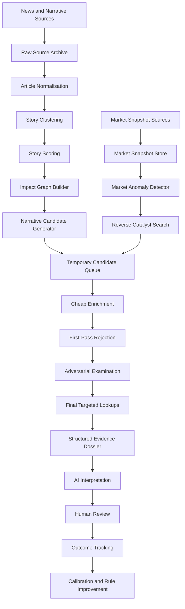

# Local Market Catalyst Intelligence System
## Development Specification

**Document type:** Implementation-grade development specification  
**Primary audience:** AI development agent  
**Deployment target:** Single-user local workstation  
**Primary objective:** Build a zero-cost, local-first market research application that discovers important stories, maps them to sectors and companies, detects unexplained market movement, aggressively rejects weak candidates, and prepares a structured evidence dossier for final AI interpretation.

---

## 1. Executive Summary

This system is not intended to predict the stock market directly, operate as an autonomous trading bot, or analyse every listed company in depth.

It is an **attention-allocation and evidence-synthesis engine**.

The system begins with two independent discovery streams:

1. **Narrative discovery**
   - Broad news
   - Macro developments
   - Political and regulatory developments
   - Industry developments
   - Company announcements
   - Emerging themes
   - Rumours and weak signals

2. **Market anomaly discovery**
   - Unusual price movement
   - Abnormal volume
   - Sector divergence
   - Volatility expansion
   - Gap behaviour
   - Peer-group movement
   - Movement without an obvious public catalyst

These streams converge into an **expiring candidate queue**. The application then performs progressively more expensive research only on candidates that survive each rejection stage.

The system must:

- Collect and preserve original source material.
- Cluster articles into stories.
- Separate repeated reporting from independent confirmation.
- Map stories to sectors, industries, themes, commodities, geographies, suppliers, customers, substitutes, and competitors.
- Generate candidate stocks from direct and indirect exposure.
- Merge narrative candidates with price and volume anomalies.
- Perform cheap enrichment first.
- Reject weak, stale, illiquid, immaterial, or already-priced-in candidates early.
- Conduct structured adversarial review.
- Perform detailed final lookups only for finalists.
- Pass a complete, traceable case file to an AI.
- Track subsequent outcomes so that rankings improve over time.

The database, event history, source lineage, and rejection logic are the core proprietary assets. AI is used selectively as an interpretation tool, not as the primary source of truth.

---

## 2. Product Definition

### 2.1 Product statement

> A local, news-led, movement-confirmed, sector-aware market research system with adversarial evidence review.

### 2.2 Core user question

The application should answer:

> Which small number of stocks deserve serious attention right now, why do they deserve attention, what evidence supports the thesis, what evidence contradicts it, and what remains unknown?

### 2.3 Primary output

The main output is not a buy or sell instruction.

The main output is a ranked set of research dossiers containing:

- The originating story or movement anomaly.
- The timeline of events.
- The affected sectors and economic relationships.
- Candidate companies and their exposure.
- Supporting evidence.
- Contradictory evidence.
- Price, volume, liquidity, and peer context.
- Materiality estimates.
- Historical analogues.
- Alternative explanations.
- Invalidating conditions.
- Remaining unknowns.
- Final AI interpretation.
- Subsequent observed outcome.

---

## 3. Scope

### 3.1 In scope

- US-listed equities as the initial implementation target.
- Provider-agnostic adapters for future market expansion.
- Broad public news discovery.
- Company announcements and official filings.
- Sector, industry, commodity, geography, supplier, customer, competitor, and theme relationships.
- Lightweight broad-universe market snapshots.
- Candidate-specific market enrichment.
- Event-driven research.
- Rules-based scoring.
- Local statistical analysis.
- Local AI inference where practical.
- Optional remote AI inference through a replaceable adapter.
- Source provenance and document lineage.
- Candidate expiry and automatic rejection.
- Historical outcome tracking.
- Manual annotations and trade journalling.
- Local web interface.
- Local database and document archive.

### 3.2 Out of scope for the initial product

- Automatic order execution.
- High-frequency trading.
- Tick-level whole-market analysis.
- Low-latency exchange colocation.
- Guaranteed market prediction.
- Automatic capital allocation.
- Fully autonomous portfolio management.
- Paid data dependencies.
- Options-flow analysis requiring commercial feeds.
- Real-time consolidated market depth.
- Full analyst-consensus history.
- Social-media manipulation detection beyond basic provenance and repetition checks.
- Public SaaS deployment.
- Multi-user access control.
- Mobile application.
- Comprehensive international market coverage.

---

## 4. Non-Negotiable Design Principles

### 4.1 Begin with events, not stocks

The system should begin by asking:

> What changed?

It should not begin by scanning every company for a generic “good stock” score.

### 4.2 Use two independent discovery directions

The system must support both:

```text
Story → sector/theme → candidate stocks
```

and:

```text
Unexplained stock movement → search for cause
```

Neither stream may depend on the other to operate.

### 4.3 Preserve evidence before interpretation

All raw source material must be stored before parsing, summarising, classifying, or embedding.

### 4.4 Separate articles from stories

Many articles may describe one event.

```text
Article ≠ Story ≠ Catalyst ≠ Trade opportunity
```

The system must maintain separate entities for each.

### 4.5 Separate confirmation from repetition

Ten pages repeating one wire report are not ten independent confirmations.

### 4.6 Reject early and often

The software should spend minimal resources on weak candidates and progressively more resources only on survivors.

### 4.7 Maintain uncertainty

The system must preserve:

- Confirmed facts.
- Inferences.
- Unconfirmed claims.
- Contradictions.
- Unknowns.

It must not silently force all evidence into a single coherent narrative.

### 4.8 Prefer deterministic computation

Software must calculate:

- Returns.
- Volume anomalies.
- Volatility.
- Ratios.
- Materiality.
- Date alignment.
- Source counts.
- Duplicate counts.
- Sector-relative movement.
- Outcome statistics.

AI must not be trusted to calculate or invent these values.

### 4.9 AI is the final interpreter, not the foundation

AI may:

- Cluster semantically similar reports.
- Extract claims.
- Propose relationships.
- Explain evidence.
- Identify contradictions.
- Build and attack a thesis.
- Produce a human-readable research memo.

AI must not:

- Invent facts.
- Invent consensus estimates.
- Infer unavailable financial values.
- Hide contradictory evidence.
- Choose timestamps.
- Calculate financial metrics.
- Treat repeated reporting as independent confirmation.
- Output a final trade instruction as if it were objective fact.

### 4.10 Every candidate must expire

Candidates are temporary research objects. They must either:

- Advance.
- Be rejected.
- Expire.
- Be archived as unresolved.
- Convert into a long-lived watch condition.

---

## 5. High-Level Architecture



---

## 6. Recommended Local Technology Architecture

The implementation should remain replaceable and provider-agnostic.

### 6.1 Suggested services

```text
market-catalyst-intelligence/
├── apps/
│   ├── api/                    Local API
│   ├── worker/                 Scheduled and event-driven jobs
│   ├── frontend/               Local browser interface
│   └── cli/                    Maintenance and diagnostic commands
├── packages/
│   ├── collectors/             Source adapters
│   ├── parsers/                Content-specific parsers
│   ├── normalisation/          Common document structures
│   ├── entity_resolution/      Company, ticker, product, and sector matching
│   ├── story_engine/           Story clustering and lifecycle
│   ├── impact_graph/           Economic relationship graph
│   ├── market_engine/          Price, volume, volatility, anomaly calculations
│   ├── candidate_engine/       Candidate creation, ranking, expiry
│   ├── scoring/                Component scoring
│   ├── adversarial_review/     Challenge framework
│   ├── ai/                     AI provider abstraction and schemas
│   ├── analytics/              Event studies and calibration
│   └── common/                 Shared types and utilities
├── migrations/
├── data/
│   ├── raw/
│   ├── documents/
│   ├── parquet/
│   ├── models/
│   └── exports/
├── tests/
├── scripts/
├── docker-compose.yml
├── pyproject.toml
└── README.md
```

### 6.2 Suggested components

- **Backend:** Python and FastAPI.
- **Operational database:** PostgreSQL.
- **Analytical storage:** Parquet.
- **Analytical query engine:** DuckDB.
- **Data transformations:** Polars.
- **Schema validation:** Pydantic.
- **Database layer:** SQLAlchemy and Alembic.
- **Scheduling:** APScheduler or an equivalent lightweight scheduler.
- **Frontend:** React, or Streamlit for the first internal version.
- **Local AI runtime:** Ollama or another replaceable local inference provider.
- **Embeddings:** Local sentence-transformer model through an abstraction.
- **Containerisation:** Docker Compose.
- **Testing:** Pytest.
- **Logging:** Structured JSON logs.
- **Configuration:** Environment variables plus versioned YAML or TOML configuration.

### 6.3 Explicitly avoid in the initial implementation

- Kubernetes.
- Kafka.
- Complex agent frameworks.
- Distributed queues.
- Microservices that require independent deployment.
- A vector database unless PostgreSQL or local files prove insufficient.
- Premature model training.
- Premature optimisation for multi-user scale.

---

## 7. Core Domain Model

The following entities should remain distinct.

### 7.1 Security

Represents a tradable security.

```yaml
Security:
  id: UUID
  ticker: string
  name: string
  exchange: string
  security_type: enum
  currency: string
  active: bool
  cik: string|null
  lei: string|null
  sector_id: UUID|null
  industry_id: UUID|null
  market_cap: decimal|null
  average_dollar_volume: decimal|null
  metadata: JSON
  created_at: datetime
  updated_at: datetime
```

### 7.2 Company

Represents the operating company or issuer.

```yaml
Company:
  id: UUID
  legal_name: string
  common_name: string
  country: string|null
  website: string|null
  investor_relations_url: string|null
  description: text|null
  aliases: JSON
  subsidiaries: JSON
  products: JSON
  commodities: JSON
  geographies: JSON
  metadata: JSON
```

A company may have multiple securities.

### 7.3 Source

Represents the publishing origin.

```yaml
Source:
  id: UUID
  name: string
  domain: string
  source_type: enum
  credibility_tier: integer
  primary_source_capable: bool
  known_syndication_parent: UUID|null
  terms_metadata: JSON
```

### 7.4 Raw document

Immutable downloaded content.

```yaml
RawDocument:
  id: UUID
  source_id: UUID
  source_url: text
  canonical_url: text|null
  retrieved_at: datetime
  first_seen_at: datetime
  claimed_published_at: datetime|null
  market_available_at: datetime|null
  http_status: integer|null
  content_type: string|null
  content_hash: string
  raw_path: text
  response_headers: JSON
  collector_version: string
  parser_status: enum
```

### 7.5 Parsed article

Normalised human-readable content.

```yaml
Article:
  id: UUID
  raw_document_id: UUID
  title: text
  body: text
  author: text|null
  language: string|null
  published_at: datetime|null
  first_seen_at: datetime
  extracted_entities: JSON
  extracted_claims: JSON
  exact_duplicate_group: UUID|null
  near_duplicate_group: UUID|null
  syndication_root_id: UUID|null
```

### 7.6 Story

Represents a developing narrative that may contain many articles.

```yaml
Story:
  id: UUID
  canonical_title: text
  neutral_summary: text|null
  first_seen_at: datetime
  last_seen_at: datetime
  status: enum
  novelty_score: float
  mention_velocity_score: float
  independent_source_count: integer
  primary_source_count: integer
  credibility_score: float
  economic_materiality_score: float
  uncertainty_score: float
  geography_ids: JSON
  sector_ids: JSON
  theme_ids: JSON
  expiry_at: datetime|null
```

### 7.7 Claim

A specific factual or speculative assertion.

```yaml
Claim:
  id: UUID
  story_id: UUID|null
  article_id: UUID
  statement: text
  claim_type: enum
  subject_entity_id: UUID|null
  object_entity_id: UUID|null
  confidence: float
  confirmation_status: enum
  first_seen_at: datetime
  primary_source_confirmed: bool
  independent_confirmation_count: integer
  contradiction_count: integer
```

### 7.8 Impact graph edge

Represents a possible economic relationship.

```yaml
ImpactEdge:
  id: UUID
  story_id: UUID
  source_entity_type: enum
  source_entity_id: UUID
  target_entity_type: enum
  target_entity_id: UUID
  relationship_type: enum
  direction: enum
  expected_horizon: enum
  exposure_strength: float
  evidence_strength: float
  materiality_estimate: float|null
  status: enum
  supporting_evidence_ids: JSON
  contradicting_evidence_ids: JSON
```

Possible relationship types:

- Direct target.
- Supplier.
- Customer.
- Competitor.
- Substitute.
- Commodity exposure.
- Regulatory exposure.
- Geographic exposure.
- Logistics exposure.
- Labour exposure.
- Government-contract exposure.
- Financing exposure.
- Technology dependency.
- Downstream producer.
- Upstream producer.

### 7.9 Market snapshot

A lightweight broad-universe observation.

```yaml
MarketSnapshot:
  security_id: UUID
  observed_at: datetime
  price: decimal
  previous_close: decimal|null
  volume: decimal|null
  day_return: float|null
  gap_return: float|null
  relative_volume: float|null
  volatility_measure: float|null
  sector_relative_return: float|null
  market_relative_return: float|null
  source: string
```

### 7.10 Market anomaly

```yaml
MarketAnomaly:
  id: UUID
  security_id: UUID
  detected_at: datetime
  anomaly_type: enum
  anomaly_score: float
  abnormal_return: float|null
  relative_volume: float|null
  sector_divergence: float|null
  volatility_expansion: float|null
  explanation_status: enum
  linked_story_ids: JSON
  expires_at: datetime
```

### 7.11 Candidate

The temporary master-list object.

```yaml
Candidate:
  id: UUID
  security_id: UUID
  created_at: datetime
  updated_at: datetime
  expires_at: datetime
  status: enum
  current_stage: enum
  origin_types: JSON
  origin_story_ids: JSON
  origin_anomaly_ids: JSON
  entry_reasons: JSON
  narrative_strength: float|null
  company_exposure: float|null
  catalyst_materiality: float|null
  source_reliability: float|null
  news_novelty: float|null
  market_confirmation: float|null
  movement_anomaly: float|null
  historical_analogue_strength: float|null
  contradiction_severity: float|null
  priced_in_risk: float|null
  tradability: float|null
  research_confidence: float|null
  final_priority: float|null
  rejection_reason: string|null
```

### 7.12 Evidence item

```yaml
EvidenceItem:
  id: UUID
  candidate_id: UUID
  evidence_type: enum
  direction: enum
  source_document_id: UUID|null
  claim_id: UUID|null
  metric_name: string|null
  metric_value: JSON|null
  description: text
  reliability: float
  materiality: float
  created_at: datetime
```

### 7.13 Research dossier

```yaml
ResearchDossier:
  id: UUID
  candidate_id: UUID
  generated_at: datetime
  dossier_version: string
  facts: JSON
  inferences: JSON
  unconfirmed_claims: JSON
  supporting_evidence: JSON
  contradicting_evidence: JSON
  unresolved_questions: JSON
  market_context: JSON
  peer_context: JSON
  materiality_analysis: JSON
  historical_analogues: JSON
  independent_ai_reviews: JSON
  final_ai_report: JSON|null
```

### 7.14 Outcome

```yaml
CandidateOutcome:
  candidate_id: UUID
  event_time: datetime
  price_at_event: decimal|null
  return_15m: float|null
  return_1h: float|null
  return_close: float|null
  return_1d: float|null
  return_2d: float|null
  return_5d: float|null
  return_10d: float|null
  return_20d: float|null
  market_adjusted_returns: JSON
  sector_adjusted_returns: JSON
  maximum_favourable_excursion: float|null
  maximum_adverse_excursion: float|null
  initial_reaction_reversed: bool|null
  outcome_notes: text|null
```

---

## 8. Pipeline Overview

```text
Stage 1: Discover stories
Stage 2: Normalise and cluster reporting
Stage 3: Score story importance and novelty
Stage 4: Build sector and economic impact graph
Stage 5: Generate narrative-linked stocks
Stage 6: Detect unexplained market anomalies
Stage 7: Reverse-search anomalies for possible causes
Stage 8: Merge all candidates into an expiring master queue
Stage 9: Perform cheap enrichment
Stage 10: Reject weak candidates
Stage 11: Conduct adversarial review
Stage 12: Perform detailed final lookups
Stage 13: Build structured dossier
Stage 14: Run independent AI analyses
Stage 15: Reconcile and produce final AI report
Stage 16: Record user decision
Stage 17: Measure outcome
Stage 18: Recalibrate rules and scores
```

---

# 9. Stage 1: Narrative and News Discovery

## 9.1 Objective

Discover potentially market-relevant changes before selecting stocks.

## 9.2 Source categories

The collector architecture must support source adapters for:

- General news feeds.
- Government announcements.
- Regulatory announcements.
- Company investor-relations pages.
- Corporate press releases.
- Official filings.
- Economic calendars.
- Industry publications.
- Trade publications.
- Commodity and shipping news.
- Government tender portals.
- Local news.
- Conference schedules and presentations.
- Patent and trial registries.
- Public social channels.
- User-supplied feeds.

Provider details must remain configurable. Do not hard-code the product around one aggregator.

## 9.3 Collector contract

Every collector must produce a `RawDocument`.

```python
class CollectorResult(BaseModel):
    source_url: str
    canonical_url: str | None
    retrieved_at: datetime
    first_seen_at: datetime
    claimed_published_at: datetime | None
    market_available_at: datetime | None
    content_type: str | None
    content_hash: str
    raw_path: str
    response_headers: dict[str, str]
```

## 9.4 Collection requirements

- Respect source-specific access limits.
- Use a descriptive user agent where required.
- Cache aggressively.
- Never redownload unchanged content unnecessarily.
- Store the original response.
- Store collector version.
- Store parser version separately.
- Continue processing when one source fails.
- Track source health.
- Implement retry with bounded exponential backoff.
- Distinguish temporary failure from permanent parser failure.

---

# 10. Stage 2: Normalisation, Deduplication, and Story Clustering

## 10.1 Normalisation

Extract:

- Canonical URL.
- Title.
- Body.
- Author.
- Claimed publication time.
- First-seen time.
- Language.
- Named entities.
- Companies.
- Securities.
- Products.
- Commodities.
- Geographies.
- Regulators.
- Event terms.
- Numeric claims.
- Source references.

## 10.2 Three levels of duplication

### Exact duplicate

Same content hash.

### Near duplicate

Small formatting or headline changes.

Possible methods:

- SimHash.
- MinHash.
- Character shingles.
- Token overlap.

### Semantic duplicate

Different wording describing the same event.

Possible methods:

- Local embeddings.
- Named-entity overlap.
- Date proximity.
- Event-keyword overlap.
- Shared quoted statements.
- Shared upstream source.

## 10.3 Syndication lineage

The system must attempt to identify:

- Original source.
- Wire-service source.
- Republishing source.
- Copy with minor edits.
- Commentary based on the same original source.

Store lineage explicitly.

## 10.4 Story lifecycle

Possible states:

```text
new
developing
confirmed
contested
stabilised
stale
disproven
archived
```

Story grouping should be reversible. The system must permit:

- Merging duplicate stories.
- Splitting incorrectly merged stories.
- Reassigning articles.
- Recomputing scores after a merge or split.

---

# 11. Stage 3: Story Scoring

Maintain separate component scores.

## 11.1 Recommended dimensions

- Novelty.
- Mention velocity.
- Independent-source count.
- Primary-source confirmation.
- Source credibility.
- Geographic scope.
- Estimated economic magnitude.
- Expected duration.
- Market relevance.
- Uncertainty.
- Contradiction.
- Timeliness.

## 11.2 Example scoring model

All values normalised to `[0, 1]`.

```text
story_priority =
    novelty
  × max(source_independence, minimum_source_floor)
  × mention_acceleration
  × estimated_economic_materiality
  × timeliness
```

Do not rely solely on this multiplicative score. Preserve all component scores.

## 11.3 Source independence

Independent-source count should be based on source lineage, not domain count.

Example:

```text
Reuters article
Yahoo repost
Local newspaper repost
Trading blog quoting Yahoo
```

This should count as one original reporting lineage, not four confirmations.

## 11.4 Story expiry

Story expiry should depend on category.

Examples:

- Breaking company rumour: hours.
- Earnings report: days.
- Regulatory proposal: weeks or months.
- Commodity supply disruption: days to months.
- Structural technology trend: months.

Expiry rules must be configurable.

---

# 12. Stage 4: Sector, Theme, and Economic Impact Graph

## 12.1 Objective

Translate a story into a set of economically exposed entities.

## 12.2 Required hierarchy

```text
Story
  ├── Direct entities
  ├── Sectors
  ├── Industries
  ├── Commodities
  ├── Geographies
  ├── Products
  ├── Technologies
  ├── Suppliers
  ├── Customers
  ├── Competitors
  ├── Substitutes
  └── Regulators
```

## 12.3 Exposure directions

Each relationship must specify whether the effect is expected to be:

- Positive.
- Negative.
- Mixed.
- Unclear.
- Conditional.

## 12.4 Exposure horizons

- Immediate.
- Intraday.
- One to five trading days.
- One to four weeks.
- One quarter.
- Multi-quarter.
- Structural.

## 12.5 Relationship validation

AI may propose relationships, but the system should attempt validation against:

- Company descriptions.
- Product lists.
- Prior filings.
- Revenue-segment information.
- Geography disclosures.
- Supplier and customer references.
- Known competitors.
- Commodity dependency.
- Government contracting history.
- Manually approved relationships.

Each relationship receives:

- Evidence strength.
- Exposure strength.
- Materiality estimate.
- Confidence.
- Review status.

## 12.6 Impact-graph example

```text
Event: New export restriction on a strategic mineral

Direct:
- Producers
- Refiners
- Exporters

Downstream:
- Semiconductor manufacturers
- RF component manufacturers
- LED producers
- Solar manufacturers

Potential beneficiaries:
- Non-restricted producers
- Recyclers
- Substitute-material providers
- Domestic capacity developers

Potential casualties:
- Import-dependent manufacturers
- Low-margin downstream users
- Companies without diversified supply

Secondary:
- Inventory build
- Input-cost inflation
- Government subsidy
- Production delay
- Supplier switching
```

---

# 13. Stage 5: Narrative Candidate Generation

## 13.1 Candidate-generation sources

A security may enter from:

- Direct company mention.
- Direct product exposure.
- Direct regulatory exposure.
- Sector association.
- Commodity association.
- Geography association.
- Supplier relationship.
- Customer relationship.
- Competitor relationship.
- Substitute relationship.
- Peer-group co-movement.
- Government-contract exposure.
- Prior event similarity.
- Manual user addition.

## 13.2 Candidate reason

Every candidate must store human-readable entry reasons.

Example:

```json
[
  {
    "type": "direct_story_exposure",
    "description": "Company named in the regulatory announcement",
    "evidence_ids": ["..."]
  },
  {
    "type": "supplier_exposure",
    "description": "Company supplies components to the affected industry",
    "evidence_ids": ["..."]
  }
]
```

## 13.3 Candidate creation threshold

A candidate should not enter merely because its sector label loosely matches.

Require at least one:

- Strong direct relationship.
- Multiple moderate indirect relationships.
- Moderate narrative relationship plus market anomaly.
- Manual override.

---

# 14. Stage 6: Broad-Universe Market Anomaly Detection

## 14.1 Objective

Detect securities moving in unusual ways regardless of whether news has already been identified.

## 14.2 Minimum broad-universe fields

For all eligible securities:

- Current or delayed price.
- Previous close.
- Daily return.
- Gap return.
- Current volume.
- Average volume.
- Average dollar volume.
- Relative volume.
- Recent volatility.
- Sector.
- Sector return.
- Market return.
- Trading status where available.

## 14.3 Eligibility filters

Exclude or penalise:

- Inactive securities.
- Test issues.
- Warrants.
- Units.
- Preferred shares.
- Extremely low-priced securities.
- Extremely low dollar volume.
- Securities with insufficient history.
- Securities with stale market data.

Thresholds must be configurable.

## 14.4 Anomaly types

- Positive abnormal return.
- Negative abnormal return.
- Abnormal relative volume.
- Gap.
- Intraday reversal.
- Volatility expansion.
- Sector divergence.
- Peer-group divergence.
- Group co-movement.
- Movement without visible catalyst.
- Movement before scheduled event.
- Repeated unusual movement across sessions.

## 14.5 Example anomaly formula

```text
movement_anomaly =
    abnormal_return
  × relative_volume
  × sector_divergence
  × volatility_expansion
  × unexplained_fraction
```

Where:

```text
unexplained_fraction =
    1 - known_catalyst_explanation_confidence
```

The implementation may use additive or weighted scoring where multiplication creates unstable behaviour. Preserve the components regardless of formula.

---

# 15. Stage 7: Reverse Catalyst Search

For every high-scoring unexplained anomaly:

```text
Unexpected movement
  ↓
Recent official filing search
  ↓
Company announcement search
  ↓
Investor-relations search
  ↓
Sector news search
  ↓
Supplier and customer search
  ↓
Regulatory search
  ↓
General news search
  ↓
Weak-signal and social search
  ↓
Explained / partially explained / unexplained
```

## 15.1 Explanation states

- Fully explained.
- Mostly explained.
- Partially explained.
- Weakly explained.
- Unexplained.
- Conflicting explanations.

## 15.2 Explanation confidence

Explanation confidence should consider:

- Event timing.
- Source quality.
- Company relevance.
- Materiality.
- Peer response.
- Market response.
- Whether movement began before publication.
- Whether the source appears to have discovered the move after it began.

---

# 16. Stage 8: Temporary Master Candidate Queue

## 16.1 Purpose

The queue is the central object that merges:

- News-led candidates.
- Movement-led candidates.
- Manual candidates.

## 16.2 Candidate stages

```text
queued
cheap_enrichment
rejected_cheap
adversarial_review
rejected_adversarial
deep_research
finalist
ai_review
human_review
watching
closed
expired
archived
```

## 16.3 Expiry

Every candidate requires an expiry time.

Examples:

- Unexplained intraday spike: 2–6 hours.
- Breaking company story: 6–24 hours.
- Earnings catalyst: 1–5 trading days.
- Regulatory development: configurable longer duration.
- Structural theme: must become a watch condition rather than remain indefinitely queued.

## 16.4 Queue behaviour

Candidates should be reprioritised whenever:

- New source appears.
- Primary confirmation appears.
- Contradiction appears.
- Market price moves.
- Volume changes.
- Peer group reacts.
- Candidate passes a stage.
- Candidate fails a stage.
- Materiality estimate changes.
- Story status changes.

---

# 17. Stage 9: Cheap Enrichment

## 17.1 Objective

Gather enough information to reject weak candidates without expensive document processing.

## 17.2 Required cheap-enrichment fields

- Security identity.
- Company identity.
- Exchange.
- Security type.
- Sector.
- Industry.
- Market capitalisation.
- Current price.
- Recent returns.
- Average dollar volume.
- Spread estimate where available.
- Relative volume.
- Recent volatility.
- Upcoming scheduled events.
- Recent filing list.
- Recent announcement list.
- High-level financial values.
- Known revenue segments.
- Known geographical exposure.
- Known products.
- Candidate relationship to the story.
- Magnitude of existing price move.
- Peer and sector movement.

## 17.3 First-pass rejection conditions

Reject or heavily penalise when:

- Security is unsupported or non-standard.
- Liquidity is below threshold.
- Spread is too wide.
- No demonstrable exposure exists.
- Relationship is based only on a broad sector label.
- Catalyst appears immaterial.
- Story is stale.
- Candidate has already moved beyond configured limits.
- Evidence is entirely derivative.
- Candidate conflicts with basic company facts.
- Scheduled earnings or another major event would dominate the thesis.
- Market data is missing or unreliable.
- Security is halted or otherwise unsuitable.
- The supposed catalyst happened outside the relevant time window.
- Candidate was generated by an incorrect entity match.

## 17.4 Rejection record

Every rejection must include:

- Rejection code.
- Human-readable reason.
- Evidence.
- Rule version.
- Timestamp.
- Whether manual override is allowed.

Rejected candidates remain queryable for later analysis.

---

# 18. Stage 10: Adversarial Examination

This stage is mandatory for all serious candidates.

The system must not rely on a generic instruction to “be sceptical.” It must run explicit challenge modules.

## 18.1 Causation challenge

Questions:

- Did the news precede the movement?
- Did the movement begin before publication?
- Is sector movement a better explanation?
- Is macro movement a better explanation?
- Was the company mentioned only because it moved?
- Is there another event at the same timestamp?

Outputs:

- Causation confidence.
- Timeline inconsistencies.
- Alternative explanations.
- Missing data.

## 18.2 Exposure challenge

Questions:

- Is the company genuinely exposed?
- Is the relationship current?
- Is exposure direct or speculative?
- What percentage of revenue, costs, assets, or production is involved?
- Is the company operationally capable of benefiting?
- Could the proposed benefit actually increase costs?
- Is the company’s exposure hedged?

Outputs:

- Exposure score.
- Exposure evidence.
- Exposure uncertainty.
- Contradictory exposure.

## 18.3 Materiality challenge

Questions:

- How large is the event relative to revenue?
- How large is it relative to earnings?
- How large is it relative to market capitalisation?
- How large is it relative to backlog?
- Does the company have capacity to realise the benefit?
- Is the impact one-time or recurring?

Outputs:

- Estimated low, base, and high materiality.
- Assumptions.
- Unavailable values.
- Confidence.

## 18.4 Novelty challenge

Questions:

- Is the information new?
- Was it previously disclosed?
- Was it anticipated?
- Is it merely a restatement?
- Was it included in prior guidance?
- Is the current report copied from earlier reporting?

Outputs:

- Novelty score.
- Prior matching disclosures.
- Repetition lineage.
- Earliest known timestamp.

## 18.5 Pricing challenge

Questions:

- How far has the stock already moved?
- Does the current move exceed plausible economic value?
- Have peers already moved?
- Did the market react before public reporting?
- Is the move likely driven by short covering?
- Is the candidate overextended relative to normal volatility?

Outputs:

- Priced-in risk.
- Overextension score.
- Remaining-opportunity estimate.
- Contradictory market evidence.

## 18.6 Source challenge

Questions:

- Is there a primary source?
- Are sources independent?
- Is the headline stronger than the source?
- Does the source have identifiable incentives?
- Has the claim changed through repetition?
- Are exact quotes supported?

Outputs:

- Source reliability.
- Source-lineage graph.
- Unsupported claims.
- Misleading headline flags.

## 18.7 Alternative-explanation challenge

Generate at least three alternative explanations.

Example:

```text
1. The catalyst is causing the move.
2. A sector rotation is causing the move.
3. A liquidity event or short covering is exaggerating the move.
4. A separate undiscovered catalyst exists.
```

The system should score each explanation using supplied evidence.

## 18.8 Tradability challenge

Questions:

- Is dollar volume sufficient?
- Is spread acceptable?
- Is current volume persistent?
- Is the security prone to halts?
- Is exit liquidity adequate?
- Is normal volatility too large for a useful invalidation threshold?
- Is the security already too extended?

Outputs:

- Tradability score.
- Liquidity flags.
- Slippage estimate where feasible.
- Halt and volatility warnings.

---

# 19. Stage 11: Final Targeted Lookups

Only finalists receive expensive enrichment.

## 19.1 Detailed lookup types

- Full relevant filings.
- Relevant filing exhibits.
- Prior comparable filings.
- Latest investor presentation.
- Previous earnings release.
- Previous earnings-call transcript if freely available.
- Detailed segment data.
- Cash, debt, dilution, and financing history.
- Insider filings.
- Offering risk.
- Peer reactions.
- Supplier reactions.
- Customer reactions.
- Commodity movement.
- Intraday price and volume.
- Historical event analogues.
- Recent management statements.
- Relevant regulatory documents.
- Conflicting or disproving sources.

## 19.2 Point-in-time discipline

All lookups used for historical evaluation must respect what was available at the relevant time.

Store:

- First seen.
- Published.
- Retrieved.
- Market available.
- Parser completion.
- AI completion.

Do not allow future information into past event studies.

---

# 20. Stage 12: Structured Evidence Dossier

The final AI must not browse blindly.

It receives a structured dossier assembled by the software.

## 20.1 Dossier schema

```json
{
  "candidate": {
    "ticker": "",
    "company": "",
    "created_at": "",
    "expires_at": "",
    "current_stage": "",
    "entry_reasons": []
  },
  "story": {
    "canonical_title": "",
    "status": "",
    "timeline": [],
    "novelty": 0,
    "source_independence": 0,
    "primary_confirmation": false
  },
  "source_lineage": [],
  "impact_graph": [],
  "company_exposure": {
    "direct": [],
    "indirect": [],
    "contradictory": [],
    "estimated_materiality": {}
  },
  "market_context": {
    "price": {},
    "volume": {},
    "volatility": {},
    "sector": {},
    "peers": {},
    "anomalies": []
  },
  "financial_context": {},
  "supporting_evidence": [],
  "contradicting_evidence": [],
  "historical_analogues": [],
  "alternative_explanations": [],
  "unresolved_questions": [],
  "independent_ai_reviews": []
}
```

## 20.2 Evidence classification

Every statement in the dossier must be one of:

- Confirmed fact.
- Computed metric.
- Supported inference.
- Weak inference.
- Unconfirmed claim.
- Contradiction.
- Unknown.

---

# 21. AI Transaction Architecture

AI should be called through a provider abstraction.

```python
class AIProvider(Protocol):
    async def complete_structured(
        self,
        task: str,
        payload: dict,
        response_schema: type[BaseModel],
        model_config: dict,
    ) -> BaseModel:
        ...
```

The system must support:

- Local model.
- Optional remote model.
- Disabled-AI mode.
- Deterministic fallback where possible.
- Prompt versioning.
- Model version logging.
- Token and latency logging.
- Schema validation.
- Retry on invalid structured output.
- No silent acceptance of malformed output.

## 21.1 Recommended independent transactions

### A. Story neutraliser

Purpose:

- Produce a neutral canonical description.
- Remove emotionally loaded wording.
- Identify the actual event.

### B. Relationship proposer

Purpose:

- Propose direct and indirect affected sectors and companies.
- Clearly label each relationship as a hypothesis.

### C. Thesis builder

Purpose:

- Construct the strongest evidence-supported positive or negative thesis.

### D. Thesis destroyer

Purpose:

- Attempt to disprove the relationship.
- Prioritise stale information, weak exposure, immateriality, and alternative explanations.

### E. Source auditor

Purpose:

- Identify unsupported claims.
- Identify source duplication.
- Identify timeline conflicts.
- Identify claims stronger than the underlying source.

### F. Market interpreter

Purpose:

- Explain whether price, volume, sector, and peer behaviour support or contradict the thesis.

### G. Reconciler

Purpose:

- Compare the independent analyses.
- Preserve unresolved disagreement.
- Produce a balanced final interpretation.

## 21.2 Independence requirement

Transactions A–F should not see one another’s generated conclusions unless explicitly necessary.

The reconciler sees all outputs only after they have completed.

## 21.3 Final AI output schema

```json
{
  "plain_english_summary": "",
  "core_thesis": "",
  "strongest_support": [],
  "strongest_objections": [],
  "confirmed_facts": [],
  "supported_inferences": [],
  "unconfirmed_claims": [],
  "most_likely_alternative_explanation": "",
  "market_confirmation_assessment": "",
  "already_priced_in_assessment": "",
  "conditions_that_invalidate_the_thesis": [],
  "next_information_to_watch": [],
  "unresolved_questions": [],
  "confidence": 0,
  "confidence_limitations": [],
  "evidence_citations": []
}
```

The final output must not contain claims without dossier evidence references.

---

# 22. Scoring Framework

Do not collapse all evidence into one score until the final queue ranking.

## 22.1 Required component scores

- Narrative strength.
- Company exposure.
- Catalyst materiality.
- Source reliability.
- News novelty.
- Market confirmation.
- Movement anomaly.
- Historical analogue strength.
- Contradiction severity.
- Already-priced-in risk.
- Tradability.
- Research confidence.

## 22.2 Example positive-evidence score

```text
positive_evidence =
    narrative_strength
  × company_exposure
  × catalyst_materiality
  × source_reliability
  × market_confirmation
  × tradability
```

## 22.3 Example final-priority score

```text
final_priority =
    positive_evidence
  × historical_support
  × remaining_opportunity
  - contradiction_penalty
  - priced_in_penalty
  - rumour_penalty
  - liquidity_penalty
```

The precise formula is intentionally open to calibration.

## 22.4 Score requirements

- Scores must be inspectable.
- Scores must have versioned calculation rules.
- Each score must include source inputs.
- Missing values must not silently become zero.
- User overrides must be logged.
- The UI must show why a score changed.
- Scoring rules must be testable against historical outcomes.

---

# 23. Historical Event Library

The event library is a core product asset.

## 23.1 Required event taxonomy

Initial categories:

- Earnings positive surprise.
- Earnings negative surprise.
- Guidance raise.
- Guidance cut.
- Material contract.
- Contract termination.
- Acquisition.
- Asset sale.
- Equity offering.
- Debt financing.
- Insider purchase.
- Insider sale.
- Activist position.
- Regulatory approval.
- Regulatory failure.
- Executive departure.
- Executive appointment.
- Restatement.
- Going concern.
- Material weakness.
- Litigation.
- Government investigation.
- Product launch.
- Product failure.
- Supply disruption.
- Commodity shock.
- Tariff or trade restriction.
- Government contract.
- Plant opening.
- Plant closure.
- Layoffs.
- Restructuring.
- Bankruptcy risk.
- Delisting risk.
- Unexplained movement.

## 23.2 Required outcomes

- 15-minute return.
- 1-hour return.
- Closing return.
- 1-day return.
- 2-day return.
- 5-day return.
- 10-day return.
- 20-day return.
- Market-adjusted return.
- Sector-adjusted return.
- Maximum favourable excursion.
- Maximum adverse excursion.
- Initial reaction reversal.
- Volume response.
- Volatility response.

## 23.3 Event-study dimensions

Allow filtering by:

- Event type.
- Market-cap bucket.
- Liquidity bucket.
- Sector.
- Industry.
- Market regime.
- Volatility regime.
- Source quality.
- Primary confirmation.
- Novelty.
- Materiality.
- Gap size.
- Initial reaction.
- Priced-in score.
- Tradability.
- Holding period.

---

# 24. User Interface Specification

The interface should be built around events and candidates, not a generic stock screener.

## 24.1 Main dashboard

Sections:

- Developing stories.
- Unexplained market anomalies.
- Candidate queue.
- Finalists.
- Expiring candidates.
- Recently rejected candidates.
- Source health.
- Collection and parser errors.

## 24.2 Candidate table

Recommended columns:

| Field | Description |
|---|---|
| Time | Candidate creation time |
| Ticker | Security |
| Company | Issuer |
| Origin | News, anomaly, or both |
| Story | Canonical story |
| Sector/theme | Primary exposure |
| Stage | Research stage |
| Narrative | Narrative strength |
| Exposure | Company exposure |
| Materiality | Estimated significance |
| Market | Market confirmation |
| Contradiction | Contradiction severity |
| Priced in | Already-priced-in risk |
| Tradability | Liquidity suitability |
| Priority | Current queue rank |
| Expiry | Automatic expiry time |

## 24.3 Candidate detail page

Required sections:

1. Executive interpretation.
2. Candidate entry reasons.
3. Story timeline.
4. Source lineage.
5. Impact graph.
6. Company exposure.
7. Exact supporting evidence.
8. Exact contradictory evidence.
9. Market chart.
10. Volume and volatility.
11. Sector and peer comparison.
12. Materiality estimate.
13. Historical analogues.
14. Alternative explanations.
15. Independent AI analyses.
16. Unresolved questions.
17. Invalidation conditions.
18. User notes.
19. User decision.
20. Subsequent outcome.

## 24.4 Story page

- Canonical title.
- Status.
- Timeline.
- Article count.
- Independent-source count.
- Primary-source status.
- Claims.
- Contradictions.
- Impact graph.
- Linked sectors.
- Linked candidates.
- Candidate outcomes.

## 24.5 Market anomaly page

- Security.
- Detection timestamp.
- Price and volume chart.
- Sector comparison.
- Peer comparison.
- Known events.
- Explanation status.
- Reverse-search results.
- Candidate link.

## 24.6 Administration pages

- Source registry.
- Collector health.
- Parser health.
- Security master.
- Company aliases.
- Sector and relationship graph.
- Scoring rule versions.
- Model and prompt versions.
- Rejection rules.
- Expiry rules.
- Data repair tools.
- Export tools.

---

# 25. Scheduling and Execution

## 25.1 Suggested job classes

- Security-master refresh.
- News collection.
- Official-filings collection.
- Company-IR collection.
- Broad-market snapshot.
- Story clustering.
- Story score recomputation.
- Impact graph recomputation.
- Candidate generation.
- Anomaly detection.
- Reverse catalyst search.
- Cheap enrichment.
- Rejection evaluation.
- Adversarial review.
- Deep research.
- AI interpretation.
- Outcome update.
- Daily calibration.
- Weekly archive and maintenance.

## 25.2 Job properties

Each job must be:

- Idempotent where practical.
- Retryable.
- Observable.
- Independently testable.
- Protected against duplicate execution.
- Version-aware.
- Able to continue after individual source failure.

## 25.3 Failure isolation

A failed AI call must not block deterministic processing.

A failed news source must not block other sources.

A parser failure must preserve the raw document for later reprocessing.

---

# 26. Observability

## 26.1 Required logging fields

- Job ID.
- Candidate ID.
- Story ID.
- Source ID.
- Document ID.
- Rule version.
- Parser version.
- AI provider.
- AI model.
- Prompt version.
- Start time.
- Completion time.
- Status.
- Error code.
- Retry count.

## 26.2 Health metrics

- Documents collected per source.
- Collection error rate.
- Parser success rate.
- Duplicate rate.
- Story-clustering confidence.
- Candidate creation count.
- Candidate rejection count.
- Candidate stage duration.
- AI validation-failure rate.
- Average dossier size.
- Average processing latency.
- Queue backlog.
- Outcome completion rate.

## 26.3 Data-quality alerts

Alert on:

- Sudden zero-document source.
- Sudden duplicate spike.
- Security-master mismatch.
- Timestamp inversion.
- Missing market data.
- Excessive unexplained movement.
- AI output schema failures.
- Candidate queue growth without rejection.
- Story explosion caused by clustering failure.

---

# 27. Security, Privacy, and Local Operation

## 27.1 Local-first requirements

- Default bind to localhost.
- No externally accessible port unless explicitly configured.
- Store secrets outside source control.
- Encrypt provider keys at rest where practical.
- Do not upload full dossiers unless a remote AI provider is deliberately enabled.
- Clearly show when data will leave the machine.
- Permit per-provider redaction.
- Permit fully offline AI operation.
- Permit AI-disabled operation.

## 27.2 Auditability

Log:

- Data sent to AI.
- AI provider used.
- Model used.
- Prompt version.
- Returned result.
- Validation failures.
- Manual edits.
- Manual overrides.
- User decisions.

---

# 28. Testing Strategy

## 28.1 Unit tests

Test:

- URL canonicalisation.
- Timestamp parsing.
- Duplicate detection.
- Story clustering.
- Source-lineage calculation.
- Company alias matching.
- Ticker matching.
- Sector mapping.
- Anomaly calculations.
- Materiality calculations.
- Rejection rules.
- Candidate expiry.
- Score calculations.
- AI schema validation.

## 28.2 Fixture-based integration tests

Create fixed historical fixtures for:

- One story with many duplicate articles.
- One story with several independent sources.
- One false company-name match.
- One direct regulatory catalyst.
- One indirect supplier catalyst.
- One unexplained price spike.
- One story discovered after price movement.
- One stale story.
- One illiquid candidate.
- One contradictory source set.
- One candidate with no primary source.
- One candidate where the initial thesis is disproven.

## 28.3 End-to-end tests

Verify:

```text
raw source
→ article
→ story
→ impact graph
→ candidate
→ enrichment
→ rejection or survival
→ dossier
→ AI report
→ outcome
```

## 28.4 Temporal-leakage tests

Historical test fixtures must confirm that no document, metric, or revision published later than the simulated decision time is available to the pipeline.

## 28.5 AI tests

- Invalid JSON handling.
- Missing citation rejection.
- Unsupported claim detection.
- Deterministic fallback.
- Different model-provider compatibility.
- Context-size handling.
- Independent-agent isolation.
- Reconciler preservation of disagreement.

---

# 29. Development Milestones

## Milestone 0: Project foundation

Deliver:

- Repository structure.
- Configuration system.
- Docker Compose.
- PostgreSQL.
- Migrations.
- FastAPI health endpoint.
- Structured logging.
- Basic CLI.
- Test framework.

Acceptance:

- Project starts locally with one command.
- Database migrations run automatically or through one documented command.
- Health status is visible.
- Tests run successfully.

## Milestone 1: Raw source archive

Deliver:

- Source registry.
- Collector interface.
- At least two source adapters.
- Immutable raw-document storage.
- Hashing.
- Retry.
- Source-health dashboard.

Acceptance:

- Documents are stored unchanged.
- Duplicate downloads are recognised.
- Source failure is visible.
- Failed parsing does not destroy data.

## Milestone 2: Article normalisation and story clustering

Deliver:

- HTML and feed parsing.
- Article model.
- Exact duplicate detection.
- Near-duplicate detection.
- Initial semantic clustering.
- Story page.
- Manual merge and split.

Acceptance:

- Repeated articles become one story.
- Original-source lineage remains visible.
- Incorrect merges can be corrected.
- Story scores recalculate after correction.

## Milestone 3: Security master and company graph

Deliver:

- Securities.
- Companies.
- Aliases.
- Sectors.
- Industries.
- Products.
- Commodities.
- Geographies.
- Relationship model.
- Manual relationship editor.

Acceptance:

- Companies can be matched from article text.
- Ambiguous matches remain unresolved rather than guessed.
- Company relationships can be inspected and edited.

## Milestone 4: Broad market snapshot and anomaly detector

Deliver:

- Market-data adapter.
- Broad-universe snapshot.
- Liquidity filters.
- Price anomaly.
- Relative-volume anomaly.
- Sector divergence.
- Volatility expansion.
- Unexplained-movement queue.

Acceptance:

- The system identifies known test anomalies.
- Low-liquidity securities are filtered or penalised.
- Data-source gaps are visible.
- Anomalies expire automatically.

## Milestone 5: Impact graph and narrative candidate generation

Deliver:

- Story-to-sector mapping.
- Story-to-theme mapping.
- Direct company mentions.
- Indirect relationship candidates.
- Candidate queue.
- Candidate expiry.
- Entry-reason records.

Acceptance:

- A story produces a traceable set of candidates.
- Every candidate has an explicit reason.
- Weak sector-only matches do not automatically pass.
- Candidate merges preserve all origins.

## Milestone 6: Cheap enrichment and rejection engine

Deliver:

- Candidate market enrichment.
- Company facts.
- Recent filing list.
- Recent announcement list.
- Materiality estimates.
- Rejection rules.
- Manual override.

Acceptance:

- Weak candidates are automatically rejected.
- Each rejection has a rule and explanation.
- Rejected candidates remain searchable.
- Rule versions are stored.

## Milestone 7: Adversarial review

Deliver:

- Causation challenge.
- Exposure challenge.
- Materiality challenge.
- Novelty challenge.
- Pricing challenge.
- Source challenge.
- Alternative explanation generator.
- Tradability challenge.

Acceptance:

- Every surviving candidate has challenge outputs.
- Contradictions are preserved.
- A candidate can be rejected because of adversarial findings.
- Each challenge is independently inspectable.

## Milestone 8: Final targeted research and dossier

Deliver:

- Full-document retrieval for finalists.
- Historical comparison.
- Peer analysis.
- Evidence dossier.
- Citation references.
- Unresolved-question list.

Acceptance:

- Dossier contains confirmed facts, inferences, claims, contradictions, and unknowns.
- Every major statement has evidence references.
- Point-in-time boundaries are enforced.

## Milestone 9: AI interpretation

Deliver:

- AI-provider abstraction.
- Local provider.
- Structured outputs.
- Thesis builder.
- Thesis destroyer.
- Source auditor.
- Market interpreter.
- Reconciler.
- Final report.

Acceptance:

- AI can be disabled.
- AI failure does not corrupt candidate data.
- Independent analyses are stored separately.
- Final report preserves unresolved disagreement.
- Unsupported uncited claims are rejected.

## Milestone 10: Outcome tracking and calibration

Deliver:

- Return tracking.
- Market-adjusted return.
- Sector-adjusted return.
- Maximum favourable excursion.
- Maximum adverse excursion.
- Event-study explorer.
- Rule-performance reports.

Acceptance:

- Outcomes populate automatically.
- Historical candidates can be grouped by event type and score.
- Rules can be compared by version.
- The system can identify which signals have and have not performed.

---

# 30. MVP Definition

The minimum useful product should include:

1. News and official-source collection.
2. Raw document archive.
3. Article normalisation.
4. Story clustering.
5. Security master.
6. Company and sector mapping.
7. Broad daily or delayed market snapshot.
8. Basic anomaly detection.
9. Candidate queue.
10. Cheap enrichment.
11. Initial rejection rules.
12. Candidate detail page.
13. Structured dossier.
14. One final AI summary.
15. Outcome tracking.

The MVP does not require:

- Multiple independent AI roles.
- Sophisticated embeddings.
- Historical model training.
- Intraday whole-market data.
- Complex supplier graphs.
- Automated trade execution.
- Social-media ingestion.

---

# 31. Post-MVP Enhancements

Possible future additions:

- More advanced source lineage.
- Better supplier and customer graph.
- Government tender monitoring.
- Job-posting trend detection.
- Patent and clinical-trial monitoring.
- Commodity-shock modelling.
- Local-news geospatial mapping.
- Management-language change detection.
- Filing-diff engine.
- Earnings-call comparison.
- Event-specific statistical models.
- Personal trade-performance feedback.
- User-specific scoring.
- Alerting.
- Watch conditions.
- International market adapters.
- Optional broker integration for position awareness only.
- Optional order staging requiring explicit manual confirmation.

---

# 32. Key Failure Modes

## 32.1 Narrative echo chamber

Cause:

- Many sources repeat one report.

Mitigation:

- Source lineage.
- Independent-source counting.
- Primary-source preference.

## 32.2 Entity-resolution error

Cause:

- Company name overlaps with a common word or another issuer.

Mitigation:

- Alias confidence.
- Ticker validation.
- Company-domain validation.
- Manual unresolved state.

## 32.3 Sector overgeneralisation

Cause:

- Candidate added because it shares a broad sector.

Mitigation:

- Require explicit exposure relationship.
- Penalise generic sector-only links.

## 32.4 Story discovered after the market moved

Cause:

- Reporting explains movement retrospectively.

Mitigation:

- Timeline comparison.
- First-seen timestamp.
- Market-available timestamp.
- Reverse-causation flag.

## 32.5 Already-priced-in thesis

Cause:

- Candidate is valid but opportunity is gone.

Mitigation:

- Pricing challenge.
- Gap and volatility comparison.
- Peer timing.
- Overextension penalty.

## 32.6 AI narrative invention

Cause:

- AI fills gaps with plausible but unsupported claims.

Mitigation:

- Structured dossier.
- Evidence IDs.
- Schema validation.
- Unsupported-claim rejection.
- Separate facts from inferences.

## 32.7 Historical leakage

Cause:

- Backtest uses revised or later-published information.

Mitigation:

- Point-in-time data rules.
- Market-available timestamps.
- Temporal-leakage tests.

## 32.8 Candidate queue bloat

Cause:

- Candidates never expire or are never rejected.

Mitigation:

- Mandatory expiry.
- Stage-time limits.
- Queue-health metrics.
- Automatic stale rejection.

## 32.9 Weak data masquerading as precision

Cause:

- Missing information is converted into confident scores.

Mitigation:

- Missing-value state.
- Confidence penalty.
- Visible data completeness.
- No silent zero substitution.

## 32.10 Model overfitting

Cause:

- Ranking rules tuned to a small historical sample.

Mitigation:

- Transparent rules.
- Out-of-sample evaluation.
- Event-category minimum sample size.
- Separate research and evaluation periods.

---

# 33. Open Implementation Decisions

The development agent should resolve these pragmatically while preserving abstraction boundaries.

## 33.1 Frontend

Options:

- Streamlit for fastest MVP.
- React for longer-term interaction quality.

Preferred approach:

- Start with Streamlit only if it does not compromise modularity.
- Otherwise implement React against FastAPI.

## 33.2 Embedding storage

Options:

- PostgreSQL extension.
- Local files.
- In-memory index.
- Dedicated vector store.

Preferred approach:

- Begin with the simplest local option.
- Do not introduce a dedicated vector database without demonstrated need.

## 33.3 Scheduling

Options:

- APScheduler.
- Operating-system scheduler.
- Lightweight task queue.

Preferred approach:

- APScheduler or equivalent in the initial local deployment.

## 33.4 Market-data provider

The implementation must use an adapter interface because free access terms, coverage, and limits may change.

Required adapter methods:

```python
class MarketDataProvider(Protocol):
    async def list_securities(self) -> list[SecurityRecord]: ...
    async def get_snapshot(self, symbols: list[str]) -> list[MarketSnapshot]: ...
    async def get_bars(
        self,
        symbol: str,
        start: datetime,
        end: datetime,
        timeframe: str,
    ) -> list[Bar]: ...
```

## 33.5 News provider

The implementation must support multiple collectors and must not rely on a single source.

## 33.6 AI model

No model should be hard-coded into the core.

The system must permit:

- Local small model for clustering or extraction.
- Stronger model for final interpretation.
- AI-disabled mode.
- Model replacement without database migration.

---

# 34. Definition of Done

The system is considered functionally successful when it can:

1. Discover a developing story.
2. Consolidate duplicated reporting.
3. identify independent and primary sources.
4. Map the story to sectors and economic relationships.
5. Generate candidate stocks with explicit reasons.
6. Independently detect an unexplained stock movement.
7. Reverse-search for possible catalysts.
8. Merge news and movement evidence.
9. Reject weak candidates cheaply.
10. Challenge surviving candidates adversarially.
11. Retrieve detailed evidence only for finalists.
12. Produce a fully traceable research dossier.
13. Generate a constrained AI interpretation.
14. Preserve disagreement and uncertainty.
15. Record what happened afterward.
16. Evaluate whether the original scoring rules were useful.

---

# 35. Final Product Philosophy

The system should not attempt to be an oracle.

It should behave like a disciplined research desk:

```text
Discover what changed.
Determine who may be affected.
Look for market confirmation.
Reject weak relationships.
Challenge the remaining thesis.
Investigate only the finalists.
Preserve all evidence and uncertainty.
Use AI to explain, not invent.
Track outcomes.
Improve the process.
```

The primary competitive advantage is not the AI model.

The primary competitive advantage is the accumulating local system of:

- Source history.
- Story history.
- Company relationships.
- Rejection logic.
- Catalyst taxonomy.
- Evidence lineage.
- Historical outcomes.
- Personal research decisions.
- Measured performance.

That system should become more useful with every processed event, regardless of which AI model is used.
